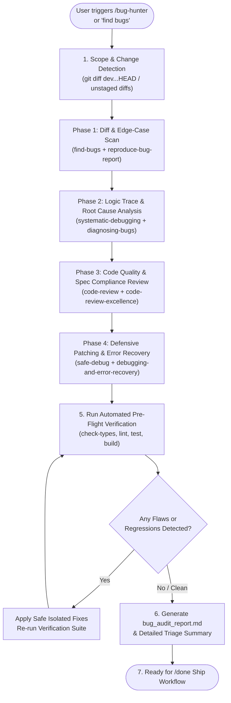

# Bug Hunter (Systematic Multi-Skill Bug Audit & Diagnostic Suite)

An automated bug-hunting orchestrator that unites specialized sub-skills to systematically detect, isolate, diagnose, and remediate logic errors, runtime faults, race conditions, edge-case regressions, and type safety issues across your branch or workspace.

---

## Orchestration Architecture



---

## The 4-Phase Systematic Execution Loop

When `/bug-hunter`, "find bugs", or "audit for bugs" is triggered:

### Phase 1: Branch Scope & Automated Edge-Case Scan (`find-bugs` + `reproduce-bug-report`)
1. **Identify the Audit Surface**:
   - Inspect all modifications against the target base (`dev`):
     ```bash
     git diff --stat origin/dev...HEAD
     ```
   - If working with uncommitted edits, analyze `git diff` and `git status`.
2. **Execute `find-bugs` heuristics**:
   - Look for unhandled `null` / `undefined` accesses, optional chaining omissions (`foo?.bar`), and unvalidated API responses.
   - Scan for async race conditions, missing `await` keywords, and unhandled promise rejections.
   - Check array bounds, off-by-one errors, and mutations of shared objects/state.
3. **If a specific bug symptom was reported (`reproduce-bug-report`)**:
   - Isolate the smallest reproducible test case.
   - Write a failing unit or integration test reproducing the exact failure before modifying application code.

---

### Phase 2: Logic Tracing & Root Cause Diagnosis (`systematic-debugging` + `diagnosing-bugs`)
1. **Apply the Scientific Method (`systematic-debugging`)**:
   - Form clear hypotheses for suspected failure paths rather than guessing.
   - Trace data flow from inputs/props -> transformations -> state updates -> UI render / database writes.
2. **Examine State & Invariant Violations (`diagnosing-bugs`)**:
   - Verify that component state transitions and database transactions maintain invariants.
   - Check for stale React closures in `useEffect` / `useCallback` / `useMemo`.
   - Inspect database query transactions in `packages/db` for connection leaks, unindexed queries, or foreign key cascades.

---

### Phase 3: Code Review & Anti-Pattern Audit (`code-review` + `code-review-excellence`)
1. **Standards Axis**:
   - Strict TypeScript compliance (no unintended `any`, unchecked type assertions `as Foo`, or suppressed linter warnings).
   - Clean Next.js Server Action vs Client Component boundaries.
   - Proper session and RBAC authorization checks on server actions.
2. **Spec & Regression Axis**:
   - Verify that new changes do not break or alter the behavior of existing features.
   - Check error boundaries, empty states, loading skeletons, and fallback states.
   - Audit responsive layout breakpoints and accessibility attributes (ARIA labels, keyboard navigation).

---

### Phase 4: Defensive Remediation & Verification (`safe-debug` + `debugging-and-error-recovery`)
1. **Apply Surgical, Defensive Fixes (`safe-debug`)**:
   - Implement localized, minimal patches that address the root cause without collateral changes.
   - Guard against invalid inputs with Zod schemas or defensive defaults.
2. **Error Recovery & Resilience (`debugging-and-error-recovery`)**:
   - Ensure user-friendly toast/alert feedback on failures instead of silent failures or infinite loaders.
   - Add graceful retries or circuit breakers where appropriate.
3. **Execute Verification Suite**:
   ```bash
   bun run check-types
   bun run lint
   bun run test
   bun run build
   ```

---

## Output Artifact: `bug_audit_report.md`

Always generate or update the `bug_audit_report.md` artifact (in `<appDataDir>\brain\<conversation-id>\bug_audit_report.md`):

```markdown
# 🛡️ Bug Audit & Diagnostic Report

## 📊 Summary of Findings
- **Branch Audited**: `feat/...` against `dev`
- **Total Files Inspected**: X
- **Issues Found**: X Critical | Y Medium | Z Advisory
- **Status**: 🟢 Clean / Verified / Remediated

## 🔍 Detailed Triage Table
| Severity | File / Symbol | Issue Description | Root Cause | Remediation Status |
|---|---|---|---|---|
| 🔴 Critical | `apps/tracker/...` | Unhandled undefined in render | Missing optional chain | Fixed & Verified |
| 🟡 Medium | `packages/db/...` | Missing transaction rollback | Async unhandled error | Fixed & Verified |
| 🔵 Advisory | `components/...` | Missing aria-label on icon button | Accessibility gap | Fixed |

## 🧪 Verification Results
- [x] TypeScript Check (`bun run check-types`): 🟢 Passed
- [x] Linting (`bun run lint`): 🟢 Passed
- [x] Unit/Integration Tests (`bun run test`): 🟢 Passed
- [x] Production Build (`bun run build`): 🟢 Passed

## 🚀 Next Steps
Branch is hardened and ready for shipping via `/done`.
```

---

## When to Run in the Workflow

```
┌──────────────┐      ┌─────────────────────────┐      ┌─────────────────────────┐      ┌─────────────┐      ┌───────────────┐
│ 1. /start    │ ---> │ 2. Implementation Phase │ ---> │ 3. /bug-hunter (NEW!)    │ ---> │ 4. /done    │ ---> │ 5. /release   │
│ Branch init  │      │ Write feature / fixes   │      │ Deep systematic audit & │      │ Ship to dev │      │ Deploy to prod│
│ & audit plan │      │                         │      │ multi-skill verification│      │ & check CI  │      │ (dev->master) │
└──────────────┘      └─────────────────────────┘      └─────────────────────────┘      └─────────────┘      └───────────────┘
```
