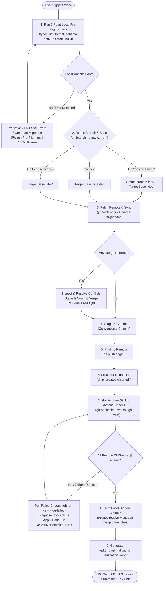

# Done Command (Global Self-Healing CI/CD Ship Workflow)

A universal skill that automates pre-flight verification, auto-migration generation, merge conflict resolution, conventional commits, remote pushes, GitHub Pull Request management, live GitHub Actions monitoring, and **automatic self-healing for any local or remote CI/CD failures**.

---

## Universal Decision Flowchart



---

## Detailed Execution Sequence

Whenever the user triggers `/done`, "done", or "ship it":

### Step 1: Run 6-Point Local Pre-Flight Checks & Auto-Fix
Run the comprehensive verification matching your GitHub Actions CI pipeline:

1. **Type Checking**:
   ```bash
   bun run check-types
   ```
   *If TypeScript errors exist*: Fix the type errors immediately.

2. **Linting & Code Formatting**:
   ```bash
   bun run lint
   bun run format:check || bun run format
   ```

3. **Database Schema Drift & Migration Check**:
   ```bash
   bun run db:check
   ```
   *If schema drift is detected* (e.g. `schema.ts` was edited without a migration):
   ```bash
   bun run db:generate
   ```
   Verify the generated migration file in `packages/db/migrations/` is staged.

4. **Unit & Integration Tests**:
   ```bash
   bun run test
   ```

5. **Production Build Verification**:
   ```bash
   bun run build
   ```
   *If build fails*: Fix module imports, syntax, or environment handling until `bun run build` succeeds with 0 errors.

---

### Step 2: Branch Detection & Target Base Selection
Determine current active branch:
```bash
git branch --show-current
```

- **If on `master` or `main`**:
  - Never push unreviewed code directly to production.
  - Create feature branch: `git checkout -b feat/<task-slug>`
  - Target PR Base: **`dev`**
- **If on `dev`**:
  - Target PR Base: **`master`**
- **If on a feature / fix / chore branch**:
  - Target PR Base: **`dev`**

---

### Step 3: Fetch Remote & Proactively Resolve Conflicts
```bash
git fetch origin
git merge origin/<target-base>
```
*If merge conflicts occur*:
1. Inspect conflicting files via `git status`.
2. Proactively resolve conflicts by combining upstream changes with local features.
3. Stage and commit: `git commit -m "merge: resolve conflicts with <target-base>"`.
4. Re-run Step 1 to guarantee zero regressions.

---

### Step 4: Stage & Commit Local Changes
1. Inspect status:
   ```bash
   git status
   ```
2. Stage all modifications (including generated migrations):
   ```bash
   git add .
   ```
3. Commit with a conventional commit message:
   ```bash
   git commit -m "<type>(<scope>): <concise summary of changes>"
   ```

---

### Step 5: Push Branch to Remote
```bash
git push origin <current-branch>
```

---

### Step 6: Create or Update GitHub Pull Request
1. Check if PR exists:
   ```bash
   gh pr list --base <target-base> --head <current-branch>
   ```
2. If PR exists:
   ```bash
   gh pr edit <pr-number> --title "<type>(<scope>): <title>" --body-file "<path-to-notes.md>"
   ```
3. If PR does not exist:
   ```bash
   gh pr create --base <target-base> --head <current-branch> --title "<type>(<scope>): <title>" --body-file "<path-to-notes.md>"
   ```

---

### Step 7: Live GitHub Actions CI/CD Monitoring & Self-Healing Loop
After pushing and creating/updating the PR, **actively monitor the remote GitHub Actions pipeline**:

1. Check PR status checks:
   ```bash
   gh pr checks
   ```
2. Wait for jobs to complete (`Typecheck`, `Lint`, `Database Migrations & Drift Check`, `Unit Tests`, `Production Build Verification`, `Playwright End-to-End Tests`).

3. **If Any Remote CI/CD Check Fails**:
   - Run: `gh run view --log-failed` to fetch the exact error logs from GitHub Actions.
   - Analyze the root cause (e.g. failing Playwright test, missing environment mock, lint error).
   - **Proactively fix the code** in the local workspace.
   - Run the local pre-flight checks to confirm the fix.
   - Stage, commit (`fix(ci): <description of fix>`), and push: `git push origin <current-branch>`.
   - Loop back to Step 7 and re-check until **ALL checks report 🟢 PASS**.

---

### Step 8: Safe Branch Cleanup
Prune dead local branches while keeping `dev`, `master`, and `main` strictly protected:
```powershell
git fetch origin --prune

# 1. Delete standard merged branches (excluding dev, master, main)
git branch --merged dev | Where-Object { $_.Trim() -notmatch '^(dev|master|main|\*)' } | ForEach-Object { git branch -d $_.Trim() }

# 2. Delete squash-merged branches whose remote tracking is ': gone]'
git branch -vv | Where-Object { $_ -match ': gone\]' -and $_.Trim() -notmatch '^(dev|master|main|\*)' } | ForEach-Object {
    $b = ($_ -split '\s+')[0].Replace('*','').Trim()
    if ($b -and $b -notin @('dev', 'master', 'main')) { git branch -D $b }
}
```

---

### Step 9: Walkthrough Compilation & Report
1. Create or update `walkthrough.md` with:
   - Summary of changes and touched files.
   - Local and remote CI/CD status verification table (all 6 checks 🟢).
   - Clickable Pull Request link.
2. Present the final summary to the user.
