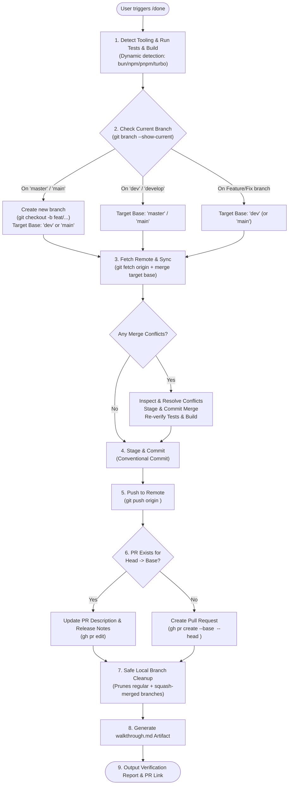

# Done Command (Global Intelligent CI/CD Ship Workflow)

A universal skill that automates project tooling detection, testing, production build verification, branch routing, proactive merge conflict resolution, conventional commits, remote pushes, GitHub Pull Request management, safe branch cleanup, and walkthrough compilation across all your projects.

---

## Universal Decision Flowchart



---

## Execution Guide

### Step 1: Detect Project Tooling & Run Tests & Build
Dynamically detect the package manager and scripts in the repository:
1. **Unit & Integration Tests**:
   - Monorepo: `npm --prefix apps/tracker run test -- --passWithNoTests` (or workspace test script).
   - Standard Node/Bun: `bun test` or `npm test -- --passWithNoTests`.
2. **Production Build**:
   - Monorepo: `bun run build` or `npx turbo run build`.
   - Next.js / Vite: `npm run build` or `bun run build`.
   - Confirm all workspaces compile cleanly with 0 errors.

---

### Step 2: Branch Detection & Target Base Selection
Determine current active branch:
```bash
git branch --show-current
```

Determine target PR base:
- **If currently on `master` or `main`**:
  - **Never push directly to production**.
  - Create branch: `git checkout -b feat/<timestamp-or-desc>` (or `fix/...`).
  - Target PR Base: **`dev`** (or `main` if no staging branch exists).
- **If currently on `dev` or `develop`**:
  - Target PR Base: **`master`** (or `main`).
- **If currently on a feature / fix / refactor branch**:
  - Target PR Base: **`dev`** (fallback: `main`/`master`).

---

### Step 3: Fetch Updates & Proactive Conflict Resolution
Always sync before pushing:
1. **Fetch from remote**:
   ```bash
   git fetch origin
   ```
2. **Merge target base into working branch**:
   ```bash
   git merge origin/<target-base>
   ```
3. **If Merge Conflicts Occur**:
   - Identify conflicted files via `git status` or grep for `<<<<<<<`.
   - Resolve conflicts by prioritizing the new feature/fix while preserving upstream additions.
   - Stage resolved files: `git add <resolved-files>`
   - Commit merge resolution: `git commit -m "merge: resolve conflicts with <target-base>"`
   - Re-run build & tests to guarantee zero regressions.

---

### Step 4: Stage & Commit Local Changes
1. Inspect uncommitted changes:
   ```bash
   git status
   git diff --stat
   ```
2. Stage all modifications:
   ```bash
   git add .
   ```
3. Commit with a conventional commit message:
   ```bash
   git commit -m "<type>(<scope>): <concise description of changes>"
   ```

---

### Step 5: Push Branch to Remote
```bash
git push origin <current-branch>
```

---

### Step 6: Create or Update Pull Request
1. Check for existing open PR:
   ```bash
   gh pr list --base <target-base> --head <current-branch>
   ```
2. **If open PR exists**:
   - Update PR body:
     ```bash
     gh pr edit <pr-number> --body-file "<path-to-notes.md>"
     ```
3. **If no open PR exists**:
   - Create PR:
     ```bash
     gh pr create --base <target-base> --head <current-branch> --title "<type>(<scope>): <title>" --body-file "<path-to-notes.md>"
     ```

---

### Step 7: Safe Merged & Gone Branch Cleanup
Prune dead local branches (both regular merged and squash-merged) while keeping `dev`, `master`, and `main` strictly protected:
```powershell
git fetch origin --prune

# 1. Delete standard merged branches (excluding dev, master, main)
git branch --merged dev | Where-Object { $_.Trim() -notmatch '^(dev|master|main|\*)' } | ForEach-Object { git branch -d $_.Trim() }

# 2. Delete squash-merged branches whose remote tracking is ': gone]'
git branch -vv | Where-Object { $_ -match ': gone\]' -and $_.Trim() -notmatch '^(dev|master|main|\*)' } | ForEach-Object {
    $b = ($_ -split '\s+')[0].Replace('*','').Trim()
    if ($b -and $b -notin @('dev', 'master', 'main')) { git branch -D $b }
}
```

---

### Step 8: Walkthrough Compilation & Report
1. Create or update `walkthrough.md` summarizing the changes, files modified, test results, and PR link.
2. Report final status to the user with a clickable link to the GitHub Pull Request.
