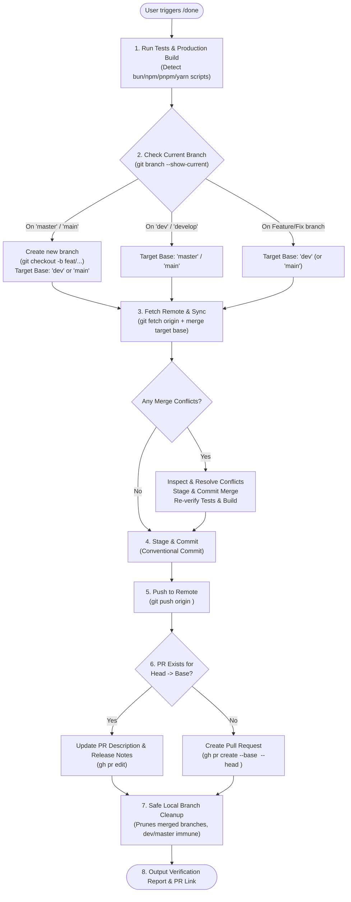

# Done Command (Global Intelligent CI/CD Ship Workflow)

A universal skill that automates testing, production build verification, branch routing, proactive merge conflict resolution, conventional commits, remote pushes, GitHub Pull Request management, and safe branch cleanup across all your projects.

---

## Universal Decision Flowchart



---

## Execution Guide

### Step 1: Detect Project Tooling & Run Tests & Build
1. **Run Unit & Integration Tests**:
   - For monorepos: Run workspace tests (e.g. `npm --prefix apps/tracker run test -- --passWithNoTests` or `bun test`).
   - For standard apps: Run `npm test -- --passWithNoTests` or `bun test`.
2. **Run Production Build**:
   - Run `bun run build` (or `npm run build` / `npx turbo run build`).
   - Confirm all workspaces or build targets compile cleanly with 0 errors.

---

### Step 2: Branch Detection & Target Base Selection
Determine current active branch:
```bash
git branch --show-current
```

Determine the default primary branch (`master` or `main`) and development branch (`dev` or `develop`):
- **If currently on `master` or `main`**:
  - **Never push directly to production**.
  - Create a new branch: `git checkout -b feat/<timestamp-or-desc>` (or `fix/...`).
  - Target PR Base: **`dev`** (or `main` if no staging branch exists).
- **If currently on `dev` or `develop`**:
  - Target PR Base: **`master`** (or `main`).
- **If currently on a feature / fix / refactor branch**:
  - Target PR Base: **`dev`** (fallback: `main`/`master`).

---

### Step 3: Fetch Updates & Proactive Conflict Resolution
Always sync before pushing to guarantee conflict-free PRs:
1. **Fetch from remote**:
   ```bash
   git fetch origin
   ```
2. **Merge target base into working branch**:
   ```bash
   git merge origin/<target-base>
   ```
3. **If Merge Conflicts Occur**:
   - Identify conflicted files via `git status` or grep for `<<<<<<<`.
   - Resolve conflicts by prioritizing the new feature/fix while preserving upstream additions.
   - Stage resolved files:
     ```bash
     git add <resolved-files>
     ```
   - Commit merge resolution:
     ```bash
     git commit -m "merge: resolve conflicts with <target-base>"
     ```
   - Re-run build & tests to guarantee zero regressions.

---

### Step 4: Stage & Commit Local Changes
1. Inspect uncommitted changes:
   ```bash
   git status
   git diff --stat
   ```
2. Stage all modifications:
   ```bash
   git add .
   ```
3. Commit with a conventional commit message:
   ```bash
   git commit -m "<type>(<scope>): <concise description of changes>"
   ```

---

### Step 5: Push Branch to Remote
```bash
git push origin <current-branch>
```

---

### Step 6: Create or Update Pull Request
1. Check for existing open PR:
   ```bash
   gh pr list --base <target-base> --head <current-branch>
   ```
2. **If an open PR exists**:
   - Update PR body:
     ```bash
     gh pr edit <pr-number> --body-file "<path-to-notes.md>"
     ```
3. **If no open PR exists**:
   - Create PR:
     ```bash
     gh pr create --base <target-base> --head <current-branch> --title "<type>(<scope>): <title>" --body-file "<path-to-notes.md>"
     ```

---

### Step 7: Safe Merged Branch Cleanup
Prune dead local branches that have been merged into `dev` while guaranteeing `dev`, `master`, and `main` can never be deleted:
```powershell
git fetch origin --prune
git branch --merged dev | Where-Object { $_.Trim() -notmatch '^(dev|master|main|\*)' } | ForEach-Object { git branch -d $_.Trim() }
```

---

### Step 8: Summary Report
Report final status with:
- Test & build status
- Branch topology (`head` $\rightarrow$ `base`)
- Conflicts resolved (if any)
- Clickable link to GitHub Pull Request
