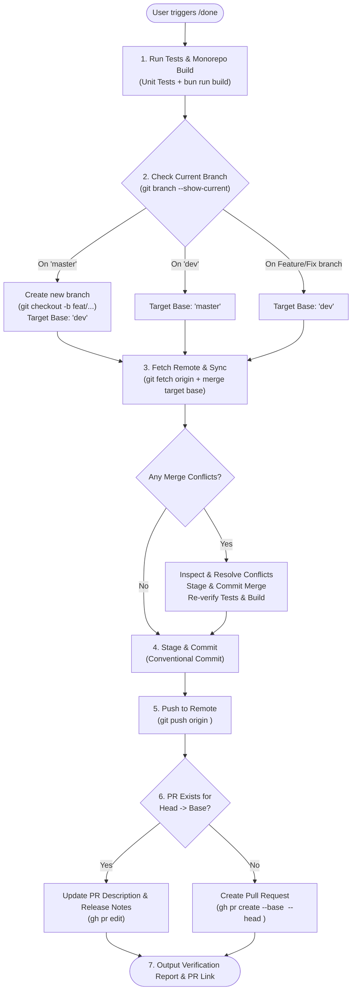

# Done Command (Intelligent Branching, Conflict-Free CI/CD Ship Workflow)

This skill automates the complete test-build-sync-resolve-commit-push-PR workflow with smart branch detection and proactive merge conflict resolution.

---

## Workflow Decision Matrix



---

## Detailed Execution Steps

### Step 1: Run Tests & Monorepo Build Verification
1. **Unit & Integration Tests**:
   ```bash
   npm --prefix apps/tracker run test -- --passWithNoTests
   ```
2. **Production Monorepo Build**:
   ```bash
   bun run build
   ```
   Ensure all workspaces (`tracker`, `admin`, `docs`) compile cleanly with 0 errors before moving forward.

---

### Step 2: Branch Detection & Target Identification
Detect the active branch using:
```bash
git branch --show-current
```

Apply the routing rules:
- **Rule A (Currently on `master`)**:
  - **Never push directly to `master`**.
  - Automatically branch off: `git checkout -b feat/<timestamp-or-feature-name>` (or `fix/...`).
  - Set PR Target Base: **`dev`**.
- **Rule B (Currently on `dev`)**:
  - Set PR Target Base: **`master`**.
- **Rule C (Currently on any feature / bugfix branch, e.g. `feat/...`, `fix/...`)**:
  - Set PR Target Base: **`dev`**.

---

### Step 3: Fetch Updates & Proactive Conflict Resolution
Always sync with remote before pushing to prevent rejected pushes and merge blocks:
1. **Fetch latest changes from origin**:
   ```bash
   git fetch origin
   ```
2. **Sync target base into current branch**:
   ```bash
   git merge origin/<target-base>
   ```
3. **If Merge Conflicts Occur**:
   - Locate conflicted files with `git status` or search for conflict markers (`<<<<<<<`).
   - Open and resolve conflicts by prioritizing the new feature functionality while preserving upstream improvements.
   - Stage resolved files:
     ```bash
     git add <resolved-files>
     ```
   - Commit the resolution:
     ```bash
     git commit -m "merge: resolve conflicts with <target-base>"
     ```
   - Re-run `bun run build` and tests to ensure the merged code builds without regressions.

---

### Step 4: Stage & Commit Local Changes
1. Review changed files:
   ```bash
   git status
   git diff --stat
   ```
2. Stage all modifications:
   ```bash
   git add .
   ```
3. Create a conventional commit (if not already committed during merge):
   ```bash
   git commit -m "<type>(<scope>): <clear description of changes>"
   ```

---

### Step 5: Push Branch to Remote
Push the current working branch to `origin`:
```bash
git push origin <current-branch>
```

---

### Step 6: Create or Update Pull Request
1. Check if an open PR exists between current branch and target base:
   ```bash
   gh pr list --base <target-base> --head <current-branch>
   ```
2. **If an open PR exists**:
   - Update the PR description and release notes:
     ```bash
     gh pr edit <pr-number> --body-file "<path-to-notes.md>"
     ```
3. **If no open PR exists**:
   - Create the PR:
     ```bash
     gh pr create --base <target-base> --head <current-branch> --title "<type>(<scope>): <title>" --body-file "<path-to-notes.md>"
     ```

---

### Step 7: Final Report
Provide a clean, bulleted summary to the user containing:
- Test execution results (test count, suite count).
- Build verification status across all workspaces.
- Branch topology (Current branch $\rightarrow$ Target base).
- Conflict resolution actions taken (if any).
- Clickable link to the created or updated GitHub Pull Request.
