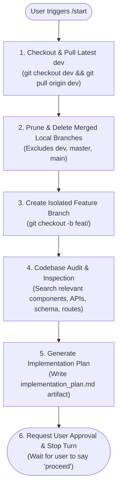

# Start Command (Global Isolated Task Initialization & Codebase Audit)

This skill ensures every new chat or feature task begins in complete isolation on a clean, up-to-date branch derived from `dev`, followed by a codebase audit and structured implementation plan before any code modifications occur.

---

## Workflow Decision Matrix



---

## Detailed Execution Sequence

Whenever the user starts a task or types `/start [task description]`:

### Step 1: Sync with Latest `dev`
1. Checkout the base development branch:
   ```bash
   git checkout dev
   ```
2. Pull latest updates from remote `origin/dev`:
   ```bash
   git pull origin dev
   ```

---

### Step 2: Prune & Cleanup Merged Local Branches
Clean up old feature branches that have already been merged into `dev` (ensuring `dev`, `master`, and `main` are strictly protected):
```powershell
# Fetch remote branch prunes
git fetch origin --prune

# Delete local branches merged into dev (excluding dev, master, main)
git branch --merged dev | Where-Object { $_.Trim() -notmatch '^(dev|master|main|\*)' } | ForEach-Object { git branch -d $_.Trim() }
```

---

### Step 3: Create a Dedicated Feature Branch
1. Derive a concise, kebab-case slug based on the user's task (e.g. `feat/tender-table-wrap`, `fix/login-redirect`, `feat/export-csv`).
2. Create and switch to the new feature branch:
   ```bash
   git checkout -b feat/<slug>
   ```

---

### Step 4: Codebase Audit & Investigation
Before writing or changing any code:
1. Search and inspect all relevant files, UI components, database schemas, server actions, and API routes related to the user's request.
2. Identify existing patterns, reusable helpers, edge cases, accessibility standards, and responsive requirements.
3. Check for potential side-effects or regressions in related modules.

---

### Step 5: Generate the Implementation Plan Artifact
1. Create or update the `implementation_plan.md` artifact (in `<appDataDir>\brain\<conversation-id>\implementation_plan.md`):
   - **Overview & User Goals**: Concise summary of what will be built or fixed.
   - **Audit Findings**: Existing code state, key files involved, and architectural context.
   - **Proposed Changes**: Exact file-by-file breakdown with `[MODIFY]`, `[NEW]`, or `[DELETE]`.
   - **Verification & Test Plan**: Automated test commands and manual verification checkpoints.
   - **User Review / Open Questions**: Highlight critical design choices or decisions.
2. Set `RequestFeedback: true` and `UserFacing: true` on the artifact metadata.

---

### Step 6: Request User Approval
Output a clear summary of the newly created branch name, the audit findings, and point the user to the `implementation_plan.md` artifact. Stop calling tools to wait for the user to review and reply with `proceed`.
