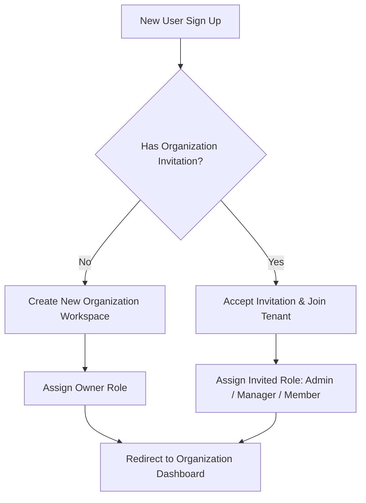

When you log into **PMG Tracker 360** for the first time, you enter the **Onboarding Flow**. This guide walks through registering your account, establishing workspace tenants, and configuring initial organization preferences.

---

## 1. Account Registration

Users register via the PMG Tracker auth portal using email credentials or SSO:
1. Navigate to `/sign-up`.
2. Enter your **Full Name**, **Email Address**, and **Password**.
3. Upon registration, an authentication session cookie is established across all PMG Tracker 360 subdomains.

---

## 2. Organization Onboarding Flow

PMG Tracker 360 is built around multi-tenant isolation. Every tender, project, client, and purchase order belongs to an **Organization Workspace**.

### Creating Your First Organization

If you are setting up a workspace for your company:
1. Enter your **Company Name** (e.g. *Solar Tech Solutions*).
2. The platform automatically generates an **Organization Slug** (e.g., `solar-tech-solutions`).
3. Select your primary industry sector (e.g., *Renewable Energy, Construction, IT Infrastructure*).
4. Click **Create Organization Workspace**.

> [!NOTE]
> As the creator of the organization, you are automatically assigned the **Owner** role with full administrative controls over billing, team member management, and workspace settings.

---

## 3. Joining an Existing Organization

If your team already uses PMG Tracker 360:
1. Ask an organization Owner or Admin to send an invitation to your email.
2. Open the email invitation link or navigate to `/invite/accept/[invitationId]`.
3. If you do not have an account, complete the sign-up step. Your account will automatically join the organization upon account creation.
4. If you already have an account, click **Accept Invitation** to add the workspace to your organization dropdown menu.

---

## 4. Switching Between Workspaces

If your user account belongs to multiple organizations:
* Click the **Workspace Switcher** in the top-left header of the dashboard.
* Select the active workspace you want to view.
* All dashboard metrics, tenders, projects, and clients will instantly refresh to reflect the active tenant data.
