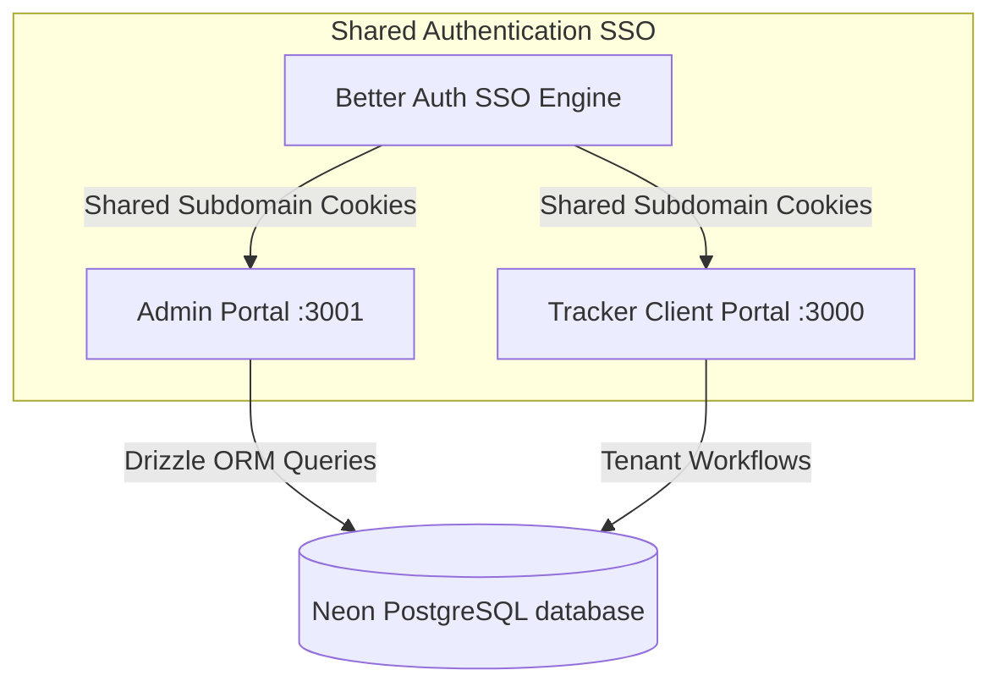

Welcome to the **System Administration Portal** documentation. The Admin Console (`apps/admin`) is a standalone, premium dashboard designed exclusively for platform operators to manage all global user profiles, tenant organization memberships, and system-wide database telemetries across the entire PMG Tracker 360 application workspace.

---

## 1. Architectural Overview

PMG Tracker 360 operates on a secure multi-tenant architecture. While standard business flows (tenders, clients, purchase orders, and project management) happen inside the client-facing tracker app, system-wide governance is isolated in the Admin Portal.



---

## 2. Authentication & Access Control

Governance of the admin console is strictly enforced on the server-side:

- **Role Requirement**: Only users with the global database field `user.role === 'admin'` are allowed access.
- **Login Enforcement**: Any attempt to access admin routes `/` or `/users` without active administrator credentials will automatically invalidate standard sessions and redirect to the security login page.
- **Secure Credentials**: The master administration credentials are set securely in the PostgreSQL cluster under:
  - **Identified Email**: `admin@tendertrack360.co.za`
  - **Passphrase**: Enforced via Better Auth email/password hashing algorithms.

---

## 3. Global User & Tenant Management

Inside the admin portal under the **Manage Users** dashboard, you can inspect, audit, and regulate every user account registered across all companies.

### System Roles vs. Organization Roles
To avoid operational confusion, roles are categorized into two scopes:

1. **System Roles (Global)**:
   - Stored directly as `role` on the `user` table.
   - Represented as `admin` (System Administrator) or `user` (Standard platform user).
2. **Organization Roles (Tenant-specific)**:
   - Stored as `role` on the `member` table.
   - Map a specific user to a specific tenant organization.
   - Roles include `owner`, `admin` (Organization Administrator), `manager`, and `member`.

### Dynamic UI Indicators
The console displays live telemetry tags for each user, making their cross-system privileges clear at a glance:
* **Gold Badge (`ADMIN`)**: Platform-wide System Administrator.
* **Slate Badge (`USER`)**: Platform-wide user.
* **Purple Badge (`[Org: owner]`)**: Primary tenant owner.
* **Blue Badge (`[Org: admin]`)**: Tenant Organization Administrator.
* **Slate Border Badge (`[Org: member]`)**: Tenant regular workspace employee.

---

## 4. Administrative Invitations & Auto-Promotions

The admin portal contains a custom invitation system allowing you to safely register new administrators.

### Invitation Flow
Clicking **Invite System Admin** opens a responsive modal input form.
1. Enter the full name, email, and initial passphrase.
2. The registration logic runs the `createSystemAdmin` server action.
3. This action registers the user under the Shared Auth context and updates their global system role to `'admin'`.

### Conflict Prevention & Smart Upgrades
To prevent duplicate signups or unique constraint database failures, the invitation logic features auto-promotion handling:

* **Case-Insensitive Resolution**: Email lookups are performed case-insensitively using lower-case conversions in Drizzle SQL queries. This prevents casing mismatches (e.g. `User@email.co.za` vs `user@email.co.za`) from bypassing security checks.
* **Automatic Role Promotion**: If you invite a user who is **already registered in the platform** (for example, an existing Organization Administrator or normal business employee):
  - The system will detect their existing database profile.
  - Instead of rejecting the invitation with a `"user already exists"` error, it will **instantly promote their global system role to `'admin'`**.
  - The newly promoted administrator can log in to the admin console immediately using their existing login email and passphrase!

---

## 5. Development & Production Operations

### Port Allocations
In the Turborepo workspace, development servers are configured on isolated ports to prevent network conflicts:
- **Client Tracker Portal**: `http://localhost:3000`
- **System Administration Portal**: `http://localhost:3001`
- **Documentation Platform**: `http://localhost:3002`

### CLI Commands
Use these global scripts to build and validate the administrative documentation codebases:

```bash
# Start all microservices in development mode
bun run dev

# Run TypeScript compilation checks across all monorepo scopes
bun run check-types

# Build the Admin Console optimized production bundle
bun --filter admin build

# Build the Documentation Platform
bun --filter docs build
```
