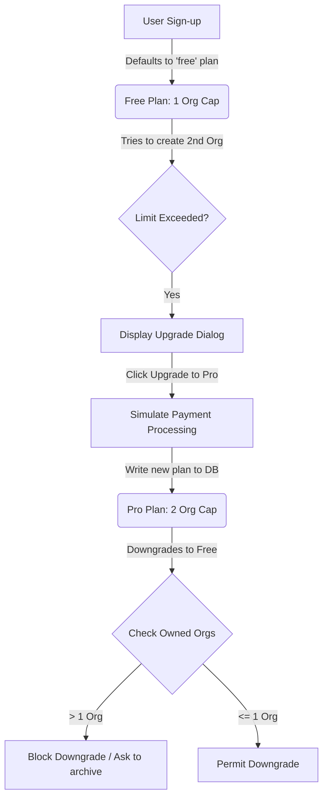

Welcome to the **Subscription & Billing Architecture** documentation. This guide details how subscription tiers, limits, database persistence, and upgrade/downgrade flows are designed and simulated across the PMG Tracker 360 platform.

---

## 1. Plan Tiers & Specifications

The platform is designed around three default subscription levels. The active tier determines the user's operational boundaries:

| Plan Tier | Price (ZAR) | Organization Limit | Active Projects | Storage Capacity | Support |
| :--- | :--- | :--- | :--- | :--- | :--- |
| **Free** | R0/month | **1 Owned Org** | 0 Projects | 100 MB | Community |
| **Starter** | R249/month | **1 Owned Org** | 2 Projects | 5 GB | Email Support |
| **Pro** | R499/month | **2 Owned Orgs** | 5 Projects | 20 GB | Priority Support |

---

## 2. Core Operational Architecture



### Database Persistence
Plan configuration is persisted in the PostgreSQL database under the `user` table:
```typescript
// packages/db/src/schema.ts
export const user = pgTable('user', {
  id: text('id').primaryKey(),
  plan: text('plan').default('free').notNull(), // 'free' | 'starter' | 'pro'
});
```

### Feature Enforcements
Operational limits are evaluated dynamically at runtime by checking the `user.plan` value in the session.
For example, organization creation capability is gated using:
```typescript
// apps/tracker/src/lib/auth.ts
allowUserToCreateOrganization: async (user) => {
  const userPlan = (user as any).plan || 'free';
  const limit = userPlan === 'pro' ? 2 : 1;
  const currentCount = await getOwnedOrganizationsCount(user.id);
  return currentCount < limit;
}
```

---

## 3. Implementation Checklist

Here is the step-by-step roadmap to implement the complete, persistent subscription flow:

### ✅ Phase 1: Database Persistence & Upgrade Dialog integration (Complete)
* Wire up `UpgradeDialog` in `upgrade-dialog.tsx` to invoke the `updateUserPlan('pro')` Server Action on upgrade.
* Show dynamic loading states and success toasts on success, forcing a dashboard refresh to update the session variables.

### ✅ Phase 2: Interactive "Billing" Settings Panel (Complete)
* Remove the redirect from `/dashboard/billing` and expose an interactive Billing settings tab.
* Display user limits dynamically via progress bars (`Organizations Created: 1 / 2`).
* Provide clear, selectable action cards to Upgrade or Cancel (Downgrade) the active subscription.

### 🔲 Phase 3: Downgrade Safety Safeguards
* Before performing a plan downgrade to `free` or `starter`, ensure they do not exceed the destination plan's organization cap.
* If they exceed the limit, display an explanatory modal instructing them to delete or archive their additional organization workspace before the downgrade can proceed.

### 🔲 Phase 4: Production Payment Gateways (Stripe/PayFast)
* Transition the simulated `updateUserPlan` calls to secure payment checkouts.
* Redirect to Stripe Checkout or PayFast payment pages.
* Create a secure endpoint `/api/webhooks/stripe` to receive subscription-events and update plan records upon successful transaction clearance.
