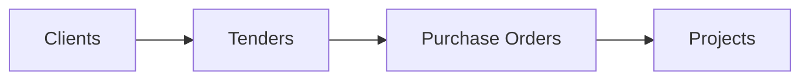

Welcome to the **PMG Tracker Client Portal** documentation. The Tracker Portal (`apps/tracker`) is the primary multi-tenant application where organizations track their end-to-end procurement pipeline, manage tenders, purchase orders, projects, and collaborate with team members.

---

## 1. Tenant & Organization Lifecycle

The client portal operates on a secure tenant model. A user can be part of multiple organizations, each isolated at the database level.

### Organization Onboarding
1. **Creation**: Users can register a brand new organization workspace via `/dashboard/organization/create`.
2. **Naming & Slugification**: Each organization receives a unique slug (e.g., `/dashboard/organization/solar-solutions`) used for scoped routing.
3. **Ownership**: The creator is assigned the role of `owner` in the tenant-mapping table.

### Inviting Team Members
Organization owners and administrators can invite employees via the **Members Tab**:
- **Member Roles**: `owner`, `admin` (Organization Admin), `manager`, and `member`.
- **Invitation Acceptance**: Invited users receive an email containing a secure link (`/invite/accept/[invitationId]`). If they already have an account, the system prompts them to sign in. If not, they complete a quick sign-up.

---

## 2. Procurement Workflows

PMG Tracker organizes business workflows into four primary modules: Tenders, Clients, Purchase Orders, and Projects.

### A. Clients Directory
- **Purpose**: Tracks public and private procuring entities, municipalities, and commercial buyers.
- **Attributes**: Contact coordinates, tax registration details, and historic billing history.

### B. Tenders Module
- **Purpose**: Manages public tenders, bids, and RFPs.
- **Features**:
  - Track submission deadlines and publication dates.
  - Upload tender specification booklets.
  - Define custom qualification criteria.
  - Track bid states: `draft`, `submitted`, `awarded`, `closed`, or `cancelled`.

### C. Purchase Orders (POs)
- **Purpose**: Links awarded contracts and purchase orders to their corresponding tenders.
- **Features**:
  - Store PO numbers, total value, and issue dates.
  - Map PO line items to specific tender components.
  - Track remaining and allocated balances to prevent budget overruns.

### D. Projects & Milestones
- **Purpose**: Manages operational execution once a tender is won and POs are issued.
- **Features**:
  - Track delivery milestones and completion dates.
  - Link multiple purchase orders to a single execution phase.
  - Upload signed delivery notes and hand-over certificates.

---

## 3. Settings & Preferences

Standard users and managers can configure their experiences via the `/dashboard/settings` menu:
- **Notification Preferences**: Toggle email notifications for tender deadlines, new invitation alerts, and project status changes.
- **Profile Customization**: Manage user avatar details, display names, and passphrases.
- **Transfer Ownership**: Organization owners can initiate a secure transfer of tenant ownership under the settings dashboard, requiring confirmation from the recipient.

---

## 4. Shared Authentication SSO

The client portal utilizes **Better Auth** with cross-subdomain cookie setups. When a user authenticates at `localhost:3000` (Tracker), they are automatically signed into `localhost:3001` (Admin) if their global system role is elevated to `'admin'`. No double logins are required.
