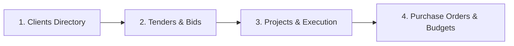

import { Card, CardGrid, LinkCard } from '@astrojs/starlight/components';

## Welcome to PMG Tracker 360

PMG Tracker 360 is an end-to-end **procurement and tendering management platform**. It helps organizations and sub-contractors run the full bid-to-delivery lifecycle from a single workspace:

Everything lives inside an **Organization Workspace** — your company's private area — with its own team, clients, and data. Each workspace is fully separate: team members only ever see the data of the workspace they are currently signed into.

## New to the platform?

Start here — these three guides take you from sign-up to your first purchase order:

- **[Quickstart Guide](/getting-started/quickstart/)** — create your account and workspace, add a client and tender, and convert a won tender into a project in under 5 minutes.
- **[Onboarding & Workspace Setup](/getting-started/onboarding/)** — registration, creating or joining an organization, and switching between workspaces.
- **[Tendering Pipeline Overview](/workflows/tendering-pipeline/)** — understand how clients, tenders, projects, and purchase orders link together.

## Core Modules

<CardGrid stagger>
	<Card title="Tenders & Bids" icon="document">
		Create, track, and manage public and private tender submissions — closing dates, tender validity, extensions, and compliance (returnables) checklists.
	</Card>
	<Card title="Clients Directory" icon="building">
		Maintain buyer profiles — municipalities, government departments, state-owned entities, and corporates — with contact and tax details.
	</Card>
	<Card title="Projects & Execution" icon="rocket">
		Convert won tenders directly into active projects, track milestones and documents, and monitor delivery progress.
	</Card>
	<Card title="Purchase Orders & Budgets" icon="pencil">
		Issue purchase orders to suppliers with line items and delivery tracking, matched against the project budget.
	</Card>
	<Card title="Calendar & Deadlines" icon="calendar">
		One view of every tender closing date, project milestone, and PO delivery across your workspace.
	</Card>
	<Card title="Reports & Analytics" icon="chart">
		Win/loss ratios, budget vs. spend, and procurement expenditure — exportable as PDF and Excel.
	</Card>
	<Card title="Team & Workspaces" icon="setting">
		Invite team members, assign roles (Owner, Admin, Manager, Member), and manage your organization settings.
	</Card>
	<Card title="Billing & Plans" icon="creditCard">
		Manage your subscription, organization limits, and invoice history under Billing.
	</Card>
</CardGrid>

## Popular Guides

<CardGrid>
	<LinkCard title="Quickstart Guide" href="/getting-started/quickstart/" />
	<LinkCard title="Workspace Setup & Settings" href="/organization/workspace-setup/" />
	<LinkCard title="Tender & Bid Management" href="/workflows/tenders-management/" />
	<LinkCard title="Projects & Execution Tracking" href="/workflows/projects-execution/" />
	<LinkCard title="Purchase Orders" href="/workflows/purchase-orders/" />
	<LinkCard title="Role Permissions Matrix" href="/reference/role-permissions-matrix/" />
	<LinkCard title="Glossary & Terms" href="/reference/glossary-and-terms/" />
</CardGrid>

## Scope of this guide

This documentation covers the **PMG Tracker 360 user app** only — the web application you use to manage tenders, projects, purchase orders, and your team. It does not cover the internal platform admin console or developer APIs.
