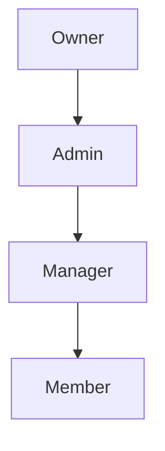

Collaboration is at the heart of **PMG Tracker 360**. Organization Owners and Admins can invite team members, assign role permissions, and control user access across all procurement workflows.

---

## 1. Inviting Team Members

To invite a colleague or employee to your workspace:
1. Navigate to `/organization` and select the **Members** tab.
2. Click **Invite Member**.
3. Enter the recipient's email address.
4. Select the initial role (`Admin`, `Manager`, or `Member`).
5. Click **Send Invitation**.

An automated invitation link will be dispatched to the user's email address. You can view, resend, or revoke pending invitations under the **Pending Invitations** section.

---

## 2. Organization Roles & Permission Matrix

PMG Tracker 360 defines four distinct tenant roles:

### Role Capabilities Summary

* **Owner**: Primary owner of the workspace tenant. Has total control including subscription management, workspace deletion, ownership transfer, and member role modification.
* **Admin**: Administrative team lead. Can invite/remove members, manage workspace settings, create/edit clients, tenders, projects, and POs. Cannot delete the organization workspace or transfer ownership.
* **Manager**: Procurement manager. Can create, edit, and manage clients, tenders, projects, and purchase orders. Cannot manage team invitations, workspace settings, or billing.
* **Member**: Standard team member or reviewer. Can view clients, tenders, projects, and purchase orders, update assigned task notes, and view reports. Cannot modify organization settings or delete records.

---

## 3. Changing Roles & Removing Members

* **Role Updates**: An Owner or Admin can change any member's role at any time from the **Members List** dropdown menu.
* **Removing Members**: Removing a member immediately revokes their access to the organization's tenders, projects, and financial records. Their user account remains intact, but they can no longer view or select that workspace.
