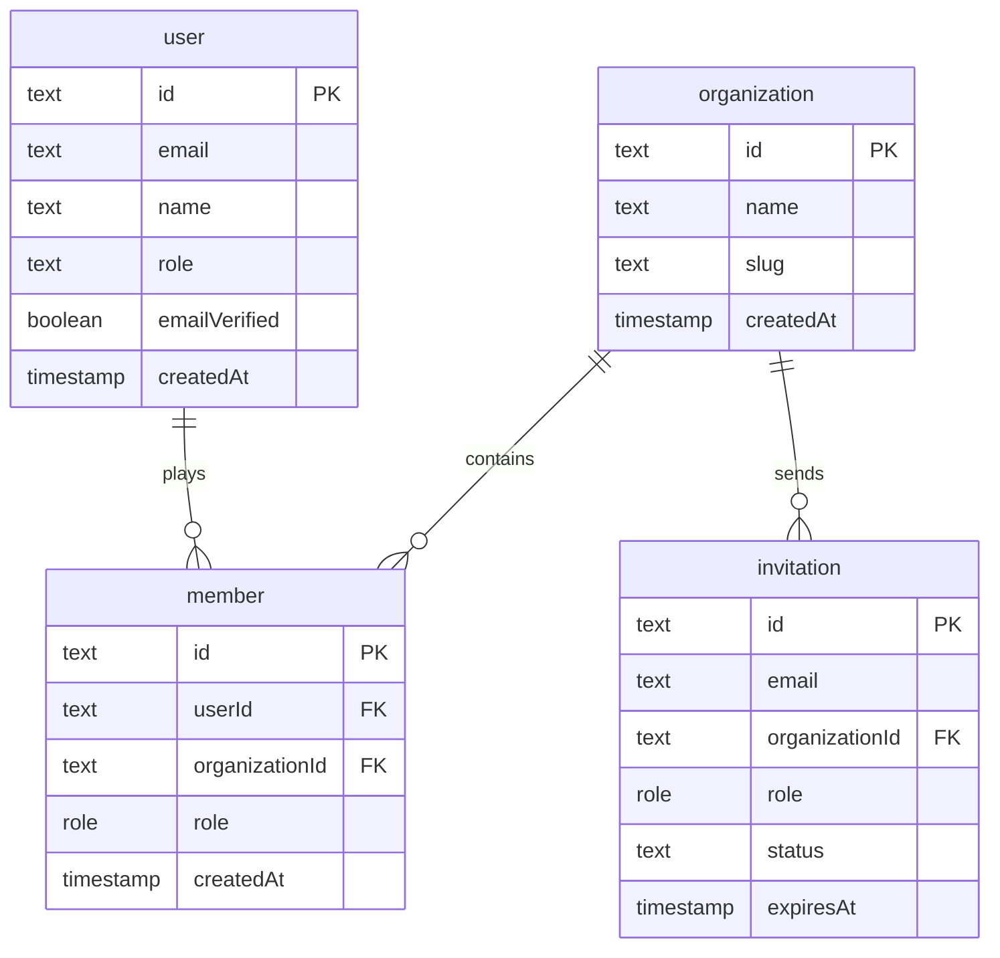

This reference page outlines the database architecture of PMG Tracker 360. The platform is backed by a serverless **Neon PostgreSQL** cluster, with schemas declared and queried via **Drizzle ORM** inside the shared workspace package `@pmg/db`.

---

## 1. Schema Diagram

The diagram below represents the core structural relations of the multi-tenant database:



---

## 2. Table Definitions

### A. The `user` Table
Stores primary user registration and platform access details:
- `id` (text, primary key): Unique identifier.
- `email` (text, unique, not null): Email address.
- `name` (text, not null): Display name.
- `role` (text, default `'user'`): Global access scope (e.g. `'admin'` or `'user'`).
- `emailVerified` (boolean, default `false`): Verification state.
- `createdAt` (timestamp, default now): Registration date.

### B. The `organization` Table
Defines business tenants on the platform:
- `id` (text, primary key): Unique identifier.
- `name` (text, not null): Organization name.
- `slug` (text, unique, not null): URL slug for scoped workspace routes.
- `createdAt` (timestamp, default now): Creation date.

### C. The `member` Table
Maps users to organizations with specific business permissions:
- `id` (text, primary key): Unique identifier.
- `userId` (text, foreign key referencing `user.id`): Mapped user.
- `organizationId` (text, foreign key referencing `organization.id`): Mapped organization.
- `role` (role enum: `'owner' | 'admin' | 'manager' | 'member'`): Tenant role.
- `createdAt` (timestamp): Join date.

### D. The `invitation` Table
Tracks sent pending team invitations:
- `id` (text, primary key): Unique identifier.
- `organizationId` (text, foreign key): Targeting organization.
- `email` (text): Recipient email address.
- `role` (role enum): Assigned role upon acceptance.
- `status` (text, default `'pending'`): Status state (`'pending' | 'accepted' | 'cancelled' | 'expired'`).
- `expiresAt` (timestamp): Expiration date.

---

## 3. Relational Configurations

Drizzle relations (`relations()`) are declared inside [schema.ts](file:///D:/websites/pmg-tracker-360/packages/db/src/schema.ts) to enable clean, typings-safe nested joins:

```typescript
// Organization Relational Rules
export const organizationRelations = relations(organization, ({ many }) => ({
  members: many(member),
  projects: many(project),
  tenders: many(tender),
  clients: many(client),
}));

// Member Relational Rules
export const memberRelations = relations(member, ({ one }) => ({
  organization: one(organization, {
    fields: [member.organizationId],
    references: [organization.id],
  }),
  user: one(user, {
    fields: [member.userId],
    references: [user.id],
  }),
}));
```
