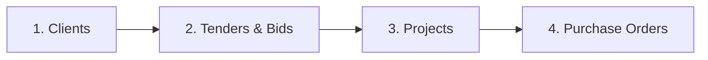

The best way to understand PMG Tracker 360 is to follow one opportunity from start to finish. Every part of the app connects to the next:

## The four stages

### Stage 1: Clients
You record the **buyers** you work with — municipalities, government departments, and companies. Every tender is linked to a client, so you always know who the opportunity is with.

### Stage 2: Tenders & Bids
You record each **opportunity** — the tender, its closing date, its value, and its documents — and track it as it moves from *Open* to *Evaluation* to *Awarded* or *Lost*.

### Stage 3: Projects
When a tender is **Awarded**, you convert it into a **project** — the delivery phase. The project keeps the client, the value, and the history from the tender.

### Stage 4: Purchase Orders
From the project you issue **purchase orders** to suppliers and sub-contractors. Each purchase order is tracked against the project's budget, so you always know how much of the contract value is committed.

---

## What happens at each step

| Step | What you do | What PMG Tracker 360 does |
| :--- | :--- | :--- |
| **Open a bid** | Click **Create Tender** on the Tenders page. | Records the tender as *Open*. |
| **Submit the bid** | Change the tender status to *Under Evaluation*. | Tracks it in reports. |
| **Win the tender** | Change the status to *Awarded*. | Offers to create a project from the tender. |
| **Start the project** | Click **Create Project from Tender**. | Pre-fills the project with the tender's client and value. |
| **Buy from suppliers** | Click **Create Purchase Order** inside the project. | Issues the purchase order and tracks it against the project budget. |
| **Receive the goods** | Mark the purchase order as *Delivered*. | Updates your financial reports. |

---

## Where to go next

- New to the app? Start with the [Quickstart Guide](/getting-started/quickstart/).
- [Tenders & Bids](/workflows/tenders-management/) — the full tender workflow.
- [Projects & Execution](/workflows/projects-execution/) — what happens after you win.
- [Purchase Orders](/workflows/purchase-orders/) — paying suppliers and tracking budgets.
