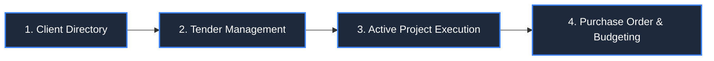

The core strength of **PMG Tracker 360** is its unified procurement pipeline. Data flows smoothly from initial buyer discovery to bidding, project execution, and purchase order tracking.

---

## 1. The 4-Stage Procurement Architecture

### Stage 1: Client Directory
Log the public entity, municipality, state department, or private corporate client issuing tenders. Maintain key buyer contact details, tax numbers, and historic bid submissions.

### Stage 2: Tender Management
Track upcoming RFPs, tender closing dates, submission status (`draft`, `submitted`, `won`, `lost`, `pending`), and bid documentation.

### Stage 3: Active Project Execution
When a tender is marked as **Won**, convert it into an operational project. Establish execution timelines, delivery milestones, and responsible project managers.

### Stage 4: Purchase Orders & Financial Budgeting
Issue purchase orders bound to active projects. Track committed expenditure against the total awarded contract value, ensuring supplier budget accountability.

---

## 2. Complete Lifecycle Flow State Machine

| Pipeline Transition | Triggering User Action | System Outcome |
| :--- | :--- | :--- |
| **Draft Bid** | Click *Create Tender* under `/tenders/create`. | Tender record created with `draft` status. |
| **Submit Bid** | Update Tender status to `submitted`. | Closing date locked; bid tracked in pending submission reports. |
| **Award Contract** | Mark Tender status as `won`. | System prompts user to initialize linked Project. |
| **Activate Project** | Click *Import Won Tender to Project*. | New active project auto-fills tender reference and buyer details. |
| **Issue PO** | Click *Create Purchase Order* inside project page. | Supplier PO issued and balance deducted from project budget cap. |
| **Complete Delivery** | Mark PO status as `delivered`. | Financial telemetries updated in executive reports dashboard. |
