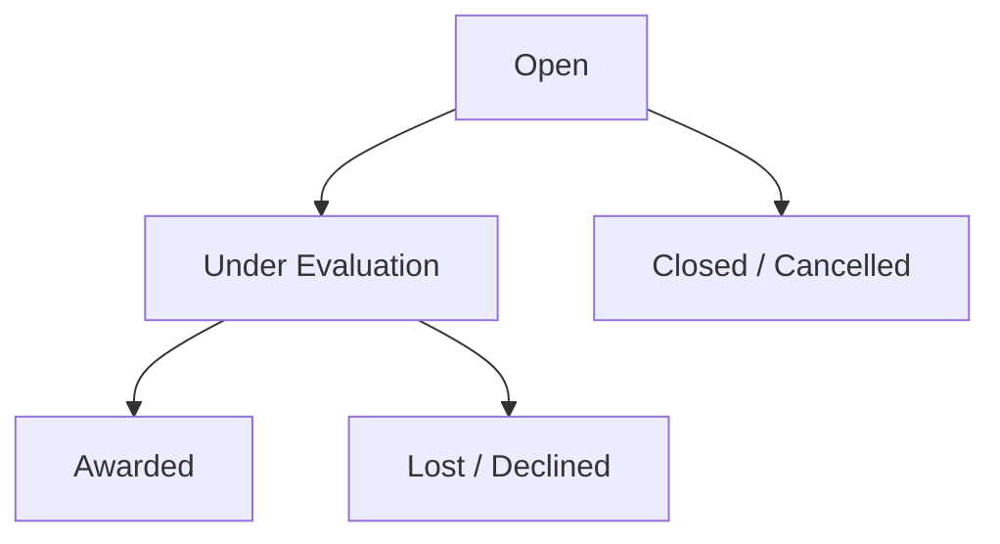

Managing tender submissions accurately is critical for revenue growth and contract compliance. **PMG Tracker 360** gives your team total visibility over tender deadlines, qualification checklists, and bid statuses.

---

## 1. Creating a New Tender Record

To log a new tender in the system:
1. Navigate to `/tenders` and click **Create Tender**.
2. Fill out the tender specification details:
   * **Tender Title**: Descriptive title of the RFP or bid opportunity.
   * **Tender Reference Number**: Official reference code (e.g., `TND-2026-9921`).
   * **Associated Client**: Select buyer from your Clients Directory.
   * **Estimated Contract Value**: Projected revenue or bid submission price (ZAR).
   * **Publication Date & Closing Date**: Precise submission deadline date and time.
   * **Category & Industry Tag**: e.g., *Civil Works, IT Hardware, Consulting*.
   * **Description**: Scope of work summary.

---

## 2. Tender Status Lifecycle

Every tender progresses through defined lifecycle states:

* **Open**: Initial bid compilation and active submission. Documents and pricing schedules are being prepared.
* **Under Evaluation**: Bid paperwork submitted to buyer and under active tender committee review.
* **Awarded**: Tender contract awarded! Ready to convert into an active project.
* **Lost / Declined**: Tender was not awarded to your team. Win/loss reasons can be recorded for analytical reporting.
* **Closed / Cancelled**: Tender deadline passed or opportunity was cancelled.

---

## 3. Attachments & Compliance Checklists

* **Specification Uploads**: Attach tender booklets, pricing schedules, and site briefing notes.
* **Returnables Checklist**: Track essential mandatory compliance documents (e.g. *Tax Clearance Pin, B-BBEE Affidavit, COIDA Certificate, CSD Registration*).
* **Automated Reminders**: Set automated email alerts 48 hours and 24 hours prior to the tender closing date.
