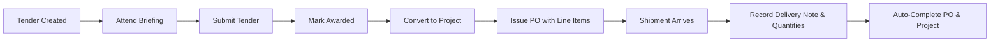

# PMG Tracker 360 – UI/UX Audit and Improvement Plan (Final Report)

> [!NOTE]
> This final synthesis report compiles the findings from all 10 sub-audits of the Tracker application, detailing the monorepo architecture, user-centric dashboards, mobile UX designs, visual systems, and a phased implementation roadmap.

---

## 1. Executive Summary

An audit of the **PMG Tracker 360 monorepo** was performed with a primary focus on the **Tracker** application. The codebase presents a solid technical foundation, built with Next.js (App Router), Tailwind CSS v4, Drizzle ORM, and Better Auth. 

However, critical gaps exist in the core business workflows:
- The tender-to-project conversion is currently blocked by a database status query mismatch (checking for `'won'` instead of `'awarded'`).
- The Purchase Order (PO) line items, delivery notes, and partial delivery receipt systems defined in the database schema are entirely unimplemented in the frontend and API layers.
- The user interface resembles a flat, standard admin panel rather than a premium, data-dense SaaS platform designed for construction and bidding operations.

### Top 5 Priority Improvements
1. **Fix the Tender-to-Project Conversion (C1):** Resolve the status query bug to allow awarded tenders to be successfully converted into active projects.
2. **Implement PO Line Items CRUD & Calculations:** Allow users to add multiple line items during PO creation, automatically calculating the total PO value.
3. **Build the Mobile Partial Delivery Capture Flow (C2):** Implement a step-by-step wizard for site managers to capture delivery note numbers, upload proof of delivery (POD) documents, and record received quantities.
4. **Refactor Navigation to Modular Dashboards:** Point persistent navigation links to dedicated module-level landing dashboards for Tenders and Projects.
5. **Upgrade Visual Polish & Micro-animations:** Apply premium card styling, glassmorphism filters, loading skeletons, and custom easing curves to reduce user friction.

### Expected Business Impact
- **Operational Clarity:** Tender administrators and site managers receive tailored workspaces, eliminating administrative overhead and screen clutter.
- **Accurate Financial Tracking:** Automatic budget calculations and real-time delivery tracking prevent over-ordering and mismatching invoice totals.
- **Improved Field Adoption:** Mobile-first card transformations, sticky action buttons, and a bottom sheet filter drawer make the app usable on-site.

### Overall Implementation Effort Estimate
- **Total Duration:** 14 weeks (arranged in 7 phases of 2 weeks each).
- **Team Requirement:** 1 Full-Stack Developer, 1 Frontend/UX Engineer.

---

## 2. Current App Understanding

### Monorepo Architecture
The project is organized as a Turborepo monorepo:
- **`apps/tracker`**: Next.js App Router workspace representing the core SaaS platform.
- **`apps/admin`**: Next.js App Router workspace representing the administrator management panel.
- **`packages/db`**: Shared Drizzle ORM package with the database schema definition.
- **`packages/ui`**: Shared UI component library containing Radix/Shadcn primitives.

### Current Capabilities
- **Tender Management:** Users can register new bids, track briefing dates, check off compliance documents, and record validity extension histories.
- **Project Headers:** Simple CRUD registers to create project numbers and client associations.
- **Purchase Order Headers:** Basic headers to track overall PO amounts and expected dates.

### Major Gaps & Limitations
- **Broken Conversion:** In `tenders.ts#L897`, `getAvailableTendersForProjects` queries for tenders with status `'won'`, but the Zod validation and update actions enforce the database schema status of `'awarded'`, blocking project creation.
- **Incomplete Details Pages:** Detail views for projects lack lists of linked Purchase Orders or contract end timelines.
- **Missing Delivery APIs:** The database tables for line items (`purchase_order_line_item`), delivery notes (`purchase_order_delivery_note`), and delivery items (`purchase_order_delivery_item`) have no supporting server actions or user interfaces.

---

## 3. Recommendations Summary

### 1. Main Dashboard Recommendations
- Provide distinct tabs for Tenders (focusing on bids and upcoming briefings) and Operations (focusing on projects, budgets, and delivery status).
- Weight the pipeline value metric card by client-specific win rates to present realistic financial projections.

### 2. Tender Mini Dashboard
- Create a dedicated landing page (`/tenders/overview`) containing pipeline progress funnel charts, upcoming briefing cards, and validity expiration lists.

### 3. Tender Register
- Redesign register tables with row hover details and orange visual indicator icons highlighting mandatory briefings.

### 4. Tender Detail Page
- Pre-populate client contacts when creating bids, and automatically calculate validity dates based on submission date and validity days inputs.

### 5. Tender Workflow
- Automatically redirect the user to `/projects/[id]` upon converting an awarded tender to a project.
- Integrate the S3 uploader with the document checklist to automatically verify compliance attachments.

### 6. Project Mini Dashboard
- Create an operations-centric landing dashboard (`/projects/overview`) that summarizes active projects, total contract budgets, open PO values, and overdue deliveries.

### 7. Project Register
- Add progress bars showing project completion (percentage of delivered PO items) directly in the register table.

### 8. Project Detail Page
- Segment details into three page-level tabs: Info, Purchase Orders, and Documents.

### 9. PO Management
- Implement a dynamic inline editing grid for line items during PO creation, calculating the total price automatically.
- Build a mobile-friendly slide-up bottom sheet for site supervisors to log deliveries and upload signed POD documents.

### 10. End-to-End Workflow Map


### 11. Navigation & Information Architecture
- Restructure the accordion sidebar to focus on modular landings.
- Implement a keyboard-activated Command Palette (`Cmd+K` / `Ctrl+K`) for power-user search queries.

### 12. Mobile UX
- Convert tabular registers into compact mobile cards showing key parameters (Client, Number, Value, Status badge).
- Move desktop search filters into a bottom-sheet slide-up drawer.

### 13. Premium UI Design System
- Load the **Inter** font family for UI dense screens and **Outfit** for clean headers.
- Define a custom easing class in `globals.css` (`transition-premium: all 0.3s cubic-bezier(0.16, 1, 0.3, 1)`) to unify animations.
- Apply card elevations, glassmorphism panels, and soft border highlights.

---

## 4. Recommended Routes

The application routing hierarchy should be structured as follows:

```
src/app/(dashboard)/
├── dashboard/                  # Main User Landing Dashboard
├── tenders/
│   ├── overview/               # Tender Module Landing Dashboard
│   ├── page.tsx                # Tender Register Table List
│   ├── create/                 # Multi-step Add Tender Wizard
│   └── [id]/
│       ├── page.tsx            # Tender Detail Page (Tabs)
│       └── edit/               # Edit Tender Form
├── projects/
│   ├── overview/               # Project Module Landing Dashboard
│   ├── page.tsx                # Project Register Table List
│   ├── create/                 # Create Project Form
│   └── [id]/
│       ├── page.tsx            # Project Detail View (Tabs: Info, POs, Docs)
│       ├── edit/               # Edit Project Info
│       └── purchase-orders/    # Purchase Orders under this specific Project
└── purchase-orders/
    ├── page.tsx                # General PO Register List (Managers Only)
    └── [id]/
        └── page.tsx            # PO Detail Page (Line Items & Delivery Logs)
```

---

## 5. Recommended Components

| Component | Target File Location | Description |
|-----------|----------------------|-------------|
| **`TenderKanban`** | `components/tenders/tender-kanban.tsx` | Visual board with drag-and-drop support for tender stages. |
| **`POLineItemsGrid`** | `components/purchase-orders/po-line-items-grid.tsx` | Dynamic table allowing inline creation/editing of items. |
| **`DeliveryReceiptModal`** | `components/purchase-orders/delivery-receipt-modal.tsx` | Slide-up bottom sheet wizard to log partial deliveries on mobile. |
| **`CommandPalette`** | `components/shared/command-palette.tsx` | Keyboard-triggered search drawer (`Cmd+K`). |
| **`TimelineTree`** | `components/ui/timeline-tree.tsx` | Vertical status tracking log for extensions and PO deliveries. |
| **`MobileCard`** | `components/shared/mobile-card.tsx` | Responsive card replacement for desktop data tables. |

---

## 6. Database / Status Improvements

### Schema Updates
1. **Tender Priority & Risk Levels:** Add `priority` (low, medium, high) and `risk_level` (low, medium, high) columns to the `tender` table.
2. **Activity Logging:** Include a `metadata` JSONB column in the `security_audit_log` table to store detailed differences of updated records.

### Status Enums
- **Tender Statuses:** `open` | `closed` | `evaluation` | `awarded` | `lost` | `cancelled`
- **Project Statuses:** `active` | `completed` | `cancelled`
- **PO Statuses:** `draft` | `issued` | `awaiting_delivery` | `partially_delivered` | `delivered` | `completed` | `cancelled` | `disputed`

---

## 7. Prioritised Implementation Roadmap

### Phase 1: Navigation and Dashboard Polish (Weeks 1-2)
- **Objective:** Fix the critical C1 blocker bug and polish base navigation elements.
- **Pages Affected:** `layout.tsx`, `tenders.ts`, `dynamic-breadcrumb.tsx`
- **Components Needed:** `AppSidebar` updates.
- **UX Improvement:** Awarded tenders appear for conversion, and navigation is smoother.
- **Developer Notes:** Change Drizzle check in `getAvailableTendersForProjects` from `'won'` to `'awarded'`.

### Phase 2: Tender Mini Dashboard and Register Improvements (Weeks 3-4)
- **Objective:** Create the landing dashboard for tenders and improve table layouts.
- **Pages Affected:** `/tenders/overview/page.tsx`, `tenders-table.tsx`
- **Components Needed:** `TenderMiniDashboard`, `BriefingWarning` icons.
- **UX Improvement:** Clear operational summaries and briefing meeting warnings.
- **Developer Notes:** Query upcoming briefings and validity warnings in parallel.

### Phase 3: Tender Detail Page and Workflow Improvements (Weeks 5-6)
- **Objective:** Automate calculations and link attachment uploads to checklists.
- **Pages Affected:** `tender-form.tsx`, `tender-details.tsx`
- **Components Needed:** `FileUploader` checklist connection hooks.
- **UX Improvement:** No manual calculation errors, and verified compliance documents.
- **Developer Notes:** Trigger auto-date calculation when days/submission inputs change.

### Phase 4: Project Mini Dashboard and Project Register (Weeks 7-8)
- **Objective:** Create the operations dashboard and add tabbed navigation to project details.
- **Pages Affected:** `/projects/overview/page.tsx`, `projects/[id]/page.tsx`
- **Components Needed:** `ProjectMiniDashboard`, `ProjectTabs`.
- **UX Improvement:** Managers can see active budgets and linked PO lists on a single page.
- **Developer Notes:** Query PO headers joined with project IDs inside the Server Component.

### Phase 5: PO Tracking and Partial Delivery Improvements (Weeks 9-10)
- **Objective:** Build the PO line items grid and delivery note capture modal.
- **Pages Affected:** `po-form.tsx`, `po-details.tsx`
- **Components Needed:** `POLineItemsGrid`, `DeliveryReceiptModal`.
- **UX Improvement:** Itemized order lists and mobile delivery capturing.
- **Developer Notes:** Implement transaction queries in Drizzle to write to `purchase_order_delivery_note` and `purchase_order_delivery_item` tables.

### Phase 6: Mobile Optimisation and Premium UI Polish (Weeks 11-12)
- **Objective:** Convert tables to cards on mobile and apply premium styling.
- **Pages Affected:** `globals.css`, core registers
- **Components Needed:** `MobileCard`, `BottomSheet` drawer.
- **UX Improvement:** Data is legible and responsive on mobile viewports.
- **Developer Notes:** Use CSS media queries to hide tables and render cards below 768px.

### Phase 7: Reporting, Alerts, and Automation (Weeks 13-14)
- **Objective:** Build keyboard search command palettes and cron reminders.
- **Pages Affected:** Root layout, `notifications.ts`
- **Components Needed:** `CommandPalette`.
- **UX Improvement:** Fast keyboard navigation and proactive validity email alerts.
- **Developer Notes:** Leverage Radix Command primitive for palette rendering.

---

## 8. Final Recommended User Journey

### Persona A: Tender Administrator
1. **Login:** Accesses the platform via magic link email.
2. **Dashboard:** Lands on `/tenders/overview`, viewing closing dates and follow-ups.
3. **Action:** Clicks "Create Tender" and enters details (validity dates calculate automatically).
4. **Attends Briefing:** Taps "Briefing Attended" directly from the dashboard reminder.
5. **Uploads Documents:** Drags tax certificates to the S3 uploader; the compliance checklist updates automatically.
6. **Submit Bid:** Taps submit, uploads proof of receipt, and waits.
7. **Outcome:** Receives notification, updates status to `'awarded'`, and clicks "Convert to Project" (the app redirects them to the new project page).

### Persona B: Manager / Owner
1. **Login:** Accesses the platform.
2. **Dashboard:** Lands on `/dashboard`, reviewing total pipeline value and win rates.
3. **Review Projects:** Clicks "Project Tracking" to check active projects.
4. **Issue PO:** Opens a project, clicks "Add PO", inputs line items, and issues the order.
5. **Alert Check:** Receives a warning badge in the sidebar for an overdue delivery, drills down, and contacts the supplier.
6. **Billing:** Reviews reports and analytics charts.

### Persona C: General User (Site Supervisor)
1. **Login:** Opens the web app on their phone.
2. **Dashboard:** Views a checklist of active tasks.
3. **Receives Delivery:** A truck arrives. The supervisor clicks "Record Delivery" on their phone, inputs the delivery note number, snaps a photo of the signed POD, updates quantities, and taps submit.
4. **Status Sync:** The PO status updates, and the project completion progress bar ticks forward.
