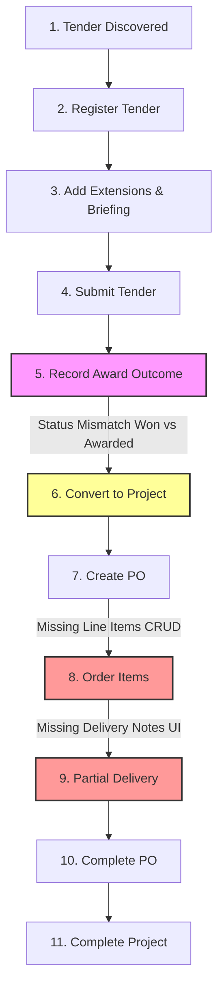

# Findings – 05-workflow.md

## Metadata

| Field | Value |
|-------|-------|
| **Prompt** | 05-workflow.md |
| **Date** | 2026-06-14 |
| **Auditor** | Antigravity |
| **Scope** | End-to-end audit of the tender-to-project lifecycle, mapping operational gaps and automation possibilities. |
| **Depends On** | 01-codebase-audit.md, 02-dashboard-audit.md, 03-tender-management.md, 04-project-management.md |

---

## Executive Summary

The Tracker monorepo maps the basic CRUD stages of the procurement lifecycle. Users can register tenders, add extension dates, convert awarded tenders into projects, and create purchase orders.

However, the end-to-end operational journey is broken in two places: First, a status query bug (C1) prevents won tenders from appearing in the project conversion list. Second, the entire materials tracking and delivery receiving workflow is unimplemented. Users cannot add line items to POs or record partial deliveries, making it impossible to calculate project progress or trigger automated completion flows.



**Overall Score: 6.0/10**

| Area | Score | Trend |
|------|-------|-------|
| Tender Lifecycle | 8.0/10 | ↑ |
| Tender-to-Project Handoff | 4.0/10 | ↓ |
| Project Execution & POs | 3.0/10 | ↓ |
| Completion & Archival | 4.0/10 | → |

---

## Current State

### What Exists Today

1. **Bid Lifecycle Support:**
   - Supports creating, editing, logging briefing attendance, tracking compliance document checklists, and recording validity extension logs.

2. **Tender conversion:**
   - Includes a conversion modal (`tender-to-project-dialog.tsx`) to spin up new projects from tenders.

3. **PO Headers:**
   - Basic CRUD records exist to track total amounts, expected delivery dates, and link PO headers to projects.

### Architecture Notes

- Actions are defined as synchronous server operations using Drizzle relational queries.
- Transitions between stages are initiated manually by updating dropdown fields in the UI.

---

## Findings

### Critical Issues

| # | Issue | Location | Impact | Effort |
|---|-------|----------|--------|--------|
| C1 | **Tender-to-Project Conversion Blocked** | `src/server/tenders.ts#L897` | Described in codebase audit. Awarded tenders cannot be converted because the backend queries for `'won'` status. | S |
| C2 | **Line Items & Deliveries Unimplemented** | `src/server/purchase-orders.ts` | Described in codebase audit. Gaps in PO line items and delivery note workflows prevent materials tracking. | L |

### Major Issues

> Issues that significantly degrade UX or operational efficiency.

| # | Issue | Location | Impact | Effort |
|---|-------|----------|--------|--------|
| M1 | **No Automated Progress Triggers** | `projects.ts`, `purchase-orders.ts` | Project completion and PO delivery statuses must be toggled manually instead of deriving automatically from delivery note quantities. | M |
| M2 | **Lacks Notification Triggers** | `src/lib/auth.ts`, server actions | There are no notification hooks (emails or alerts) when a tender is nearing its validity expiration or a PO delivery is late. | M |

### Minor Issues

> Polish items, inconsistencies, and small UX improvements.

| # | Issue | Location | Impact | Effort |
|---|-------|----------|--------|--------|
| m1 | **Manual Bid Number Generation** | `tender-form.tsx` | Bidders must manually enter a tender number, which can lead to formatting errors instead of generating sequential IDs. | S |
| m2 | **Clunky Conversion Redirection** | `tender-details.tsx` | Converting an awarded tender into a project does not redirect the user to the newly created project page, causing confusion. | S |

---

## Recommendations

### Quick Wins (1-2 days)

1. **Fix Redirection on Conversion**
   - **What**: Modify the `tender-to-project` server action return value to include the new project ID and redirect the client page to `/projects/[id]` on success.
   - **Where**: `apps/tracker/src/components/tenders/tender-to-project-dialog.tsx`
   - **Expected outcome**: Seamless user handoff from bids to active projects.

2. **Add Validity Reminder Alerts**
   - **What**: Create an automated check that generates in-app notifications for users when bids validity dates are within 14 days.
   - **Where**: `apps/tracker/src/server/notifications.ts`
   - **Expected outcome**: Prevents bid expiration without follow-up.

### Short-Term (1-2 weeks)

1. **Automate PO Progress Calculations**
   - **What**: Calculate the total amount of a PO automatically as the sum of its line items, and update its status to "Partially Delivered" or "Delivered" based on cumulative delivery note quantities.
   - **Where**: `apps/tracker/src/server/purchase-orders.ts`
   - **Expected outcome**: Accurate, automated billing summaries.

2. **Implement Project-PO Status Linkage**
   - **What**: Automatically update project status to "Completed" when all linked Purchase Orders are marked "Completed" and the contract end date has passed.
   - **Where**: `apps/tracker/src/server/projects.ts`
   - **Expected outcome**: Reduces manual administrative updates.

### Medium-Term (1-3 months)

1. **Full Supply Chain Workflow Integration**
   - **What**: Implement the full chain:
     1. Pre-populate project values from awarded tenders.
     2. Add items to PO.
     3. Generate delivery notes from barcode/file uploads on-site.
     4. Calculate outstanding quantities and update project progress bars.
   - **Expected outcome**: Complete operational transparency for construction managers.

---

## Component Inventory

| Component | Current State | Recommended State | Priority |
|-----------|--------------|-------------------|----------|
| **Tender-to-Project Dialog** | Basic fields modal. | Automate project name, client ID, and award value values. | P0 |
| **PO Status Card** | Static status text. | Visual progress bar showing % delivered, % outstanding, and disputed items. | P0 |
| **Activity Feed** | Flat log. | Group activities by project stage with direct link tags. | P2 |

---

## Cross-References

### Dependencies (findings this prompt consumed)

| Prompt | Key Finding Used |
|--------|------------------|
| 01-codebase-audit.md | Monorepo route structures and database model relations. |
| 02-dashboard-audit.md | Highlighted alerts and task trackers. |
| 03-tender-management.md | Tender extensions and results logs. |
| 04-project-management.md | Purchase order creation and delivery note structures. |

### Outputs (findings to pass forward)

| Prompt | Key Finding to Consume |
|--------|------------------------|
| 09-forms-data-capture.md | Validations for transition quantities. |
| 10-deliverables-roadmap.md | Arranging workflow steps into implementation stages. |

---

## Implementation Notes

### Affected Files

```
apps/tracker/src/server/tenders.ts
apps/tracker/src/server/projects.ts
apps/tracker/src/server/purchase-orders.ts
apps/tracker/src/components/tenders/tender-to-project-dialog.tsx
```

### New Files Required

```
apps/tracker/src/server/hooks/workflow-triggers.ts
```

### Database Changes

- [ ] Add check constraints to ensure delivery item quantities cannot exceed ordered quantities.

### API Changes

- [ ] Add API/Action: `getProjectWorkflowStatus`.
- [ ] Connect webhook or cron job to trigger validity warning checks daily.
