# PMG Tracker 360: Customer Journey Audit Overview

This document provides a comprehensive overview of the **Customer Journey Audit** conducted for the PMG Tracker 360 platform—a South African public sector procurement tracking and delivery management solution. 

The audit traces the entire operational lifecycle from the moment a user signs up and onboarding to the platform, registers clients, tracks tender opportunities, manages bid extensions, awards tenders, transitions into active projects, and executes purchase orders (POs) up to delivery.

---

## 1. Executive Summary

While the current foundation of PMG Tracker 360 is solid—leveraging a modern multi-tenant architecture, Next.js 16, React 19, Tailwind CSS 4, and Better Auth—our deep audit of the customer journey has revealed several critical security gaps, database design discrepancies, missing workflows, and UI/UX friction points.

### Key Highlights of Findings:
1. **Critical Security Vulnerabilities**: Server actions for `tenders`, `clients`, and `projects` completely bypass session and organization-level authorization checks. A user can fetch, update, or delete records across organizations simply by passing raw IDs.
2. **Key Lifecycle Gaps**: 
   - **Tender Stage**: Lacks mandatory briefing/clarification meeting tracking and bid compliance checklists (CSD, BBBEE, Tax Clearance, MBD forms), which are major causes of administrative disqualification in South African bidding.
   - **Tender Extension Stage**: Lacks Edit/Delete capabilities, leading to immutable errors in validity dates.
   - **Transition Stage**: Abruptly creates projects on "Awarded" status without prompting the user for final contract parameters (e.g. actual award value, duration, SLA documents).
   - **PO Stage**: Excludes the `deliveredAt` timestamp from the form, preventing retroactive delivery logs. Lacks itemization (line items) and formal Delivery Notes / POD (Proof of Delivery) verification.
   - **Invoices**: The database contains no `invoice` table or tracking mechanism, stopping the journey before the actual payment loop is completed.
3. **Database Performance Risks**: Financial values are stored as `text` strings, requiring memory-heavy JS parsing for dashboard aggregates instead of database-native operations.
4. **UI/UX Friction**: Lacks currency-formatted inputs, has a broken organization switcher in the UI, and onboarding is too restrictive.

---

## 2. Customer Journey Map (Current vs. Proposed)

The diagram below maps the current lifecycle against the proposed comprehensive journey, highlighting the missing flows that need to be introduced to make the platform production-grade.

```mermaid
flowchart TD
    classDef current fill:#1e3a8a,stroke:#3b82f6,stroke-width:2px,color:#fff;
    classDef missing fill:#7f1d1d,stroke:#ef4444,stroke-width:2px,color:#fff;
    classDef database fill:#14532d,stroke:#22c55e,stroke-width:2px,color:#fff;

    %% Journey Steps
    SignUp[1. Sign Up / Google Auth]:::current
    Onboarding[2. Create Org / Onboarding]:::current
    InviteFlow[2a. Accept Invitation Flow]:::missing
    
    ClientMgmt[3. Client Management]:::current
    GovPreset[3a. SA Gov Client Presets]:::missing
    
    TenderTrack[4. Tender Opportunity Tracking]:::current
    Clarification[4a. Mandatory Briefing Tracking]:::missing
    Compliance[4b. Bid Compliance Checklist]:::missing
    
    TenderExt[5. Bid Validity Extensions]:::current
    ExtCRUD[5a. Edit/Delete Extensions]:::missing
    
    TenderAward[6. Bid Awarded / Transition]:::current
    AwardDetails[6a. Award Confirmation Dialog]:::missing
    
    ProjectExecution[7. Project Active]:::current
    SLAUpload[7a. SLA & Contract Management]:::missing
    
    POTracking[8. PO Tracking]:::current
    deliveredAtEdit[8a. Manual deliveredAt Field]:::missing
    POItems[8b. PO Line Items & Quantities]:::missing
    PODUpload[8c. Proof of Delivery Upload]:::missing
    
    InvoiceMgmt[9. Invoice & Payment Cycle]:::missing

    %% Relationships
    SignUp --> Onboarding
    Onboarding --> InviteFlow
    InviteFlow --> ClientMgmt
    ClientMgmt --> GovPreset
    GovPreset --> TenderTrack
    TenderTrack --> Clarification
    Clarification --> Compliance
    Compliance --> TenderExt
    TenderExt --> ExtCRUD
    ExtCRUD --> TenderAward
    TenderAward --> AwardDetails
    AwardDetails --> ProjectExecution
    ProjectExecution --> SLAUpload
    SLAUpload --> POTracking
    POTracking --> deliveredAtEdit
    deliveredAtEdit --> POItems
    POItems --> PODUpload
    PODUpload --> InvoiceMgmt
```

---

## 3. Directory Structure of Audit Documentation

This audit report is divided into several sections for detailed reading:

1. **[Overview (README.md)](file:///D:/websites/pmg-tracker-360/docs/customer-journey-audit/overview.md)**: This summary page.
2. **[Product & Architecture Audit](file:///D:/websites/pmg-tracker-360/docs/customer-journey-audit/product-architecture-audit.md)**: Introduction to PMG Tracker 360, the core problems it solves, its modules, and a roadmap of recommended future modules (Invoices, Checklists, Calendar, etc.).
3. **[Detailed Audit Findings](file:///D:/websites/pmg-tracker-360/docs/customer-journey-audit/audit-findings.md)**: A step-by-step breakdown of every step in the journey, code auditing, security checks, and logic errors.
4. **[UI/UX Assessment & Recommendations](file:///D:/websites/pmg-tracker-360/docs/customer-journey-audit/ui-ux-assessment.md)**: Evaluation of the UI/UX flows, ZAR currency formatting, feedback loops, responsiveness, and aesthetic updates.
5. **[Proposed Technical Solutions](file:///D:/websites/pmg-tracker-360/docs/customer-journey-audit/proposed-solutions.md)**: Detailed code templates, database schemas, and migration path snippets to resolve all audited issues.
6. **[Link Analysis Report](file:///D:/websites/pmg-tracker-360/docs/customer-journey-audit/link-analysis.md)**: An automated scan validating all internal references, files, and paths.

---

> [!IMPORTANT]
> The issues highlighted in this audit are critical for the security and usability of the application. The most pressing items are **securing the server actions** and **implementing the missing invoice table** to complete the financial cycle. Refer to the respective files for complete details.
