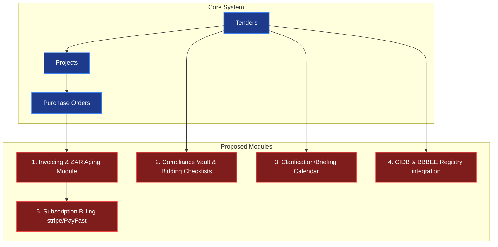

# PMG Tracker 360: Product Definition & Architecture Audit

This document delivers a detailed product and architectural audit of **PMG Tracker 360**. It defines what the application is, its core capabilities, the specific business challenges it solves in the South African procurement landscape, a breakdown of its technical modules, and recommendations for future features and modules.

---

## 1. Product Definition & Core Capabilities

### What is PMG Tracker 360?
**PMG Tracker 360** is a secure, multi-tenant B2B SaaS (Software as a Service) platform designed to manage and track the end-to-end procurement lifecycle for businesses bidding on public and private sector contracts. It acts as an operational system of record that bridges the gap between discovering a bidding opportunity, preparing the submission, securing the award, executing projects, and matching financial purchase orders (POs) with delivery details.

### Target Audience:
* South African contractors, consultants, and suppliers bidding for municipal (e.g. City of Joburg, Ekurhuleni), provincial (e.g. Gauteng Department of Health), and national public sector tenders.
* B2B enterprises requiring clean tenant-level isolation for tracking multiple bidding teams, clients, projects, and sub-contractor POs.

### What the Application Does:
1. **Multi-Tenant Organization Workspaces**: Supports independent organizational environments secured via **Better Auth** and [packages/db/src/schema.ts](../../packages/db/src/schema.ts). Users can invite team members with specific roles (`owner`, `admin`, `manager`, `member`).
2. **Client Directory**: Centralizes buyer profiles (municipalities, state-owned enterprises, private corporates) with contact coordinates, notes, and historical tenders.
3. **Tender Pipeline Tracking**: Tracks bid opportunities from draft stage, submission deadlines, estimated values, and evaluation periods.
4. **Validity Extension Logs**: Tracks bid validity extensions requested by clients—including new evaluation dates and contact records—to prevent bid expiration.
5. **Auto-Project Transition**: Automatically creates linked `project` records when a tender status changes to `'awarded'`, copying key metadata and redirecting users to the project workspace.
6. **PO Matching and Delivery tracking**: Tracks purchase orders issued under active projects, mapping supplier names, values, expected/actual delivery dates, and delivery addresses.
7. **Document Management**: Handles file uploads associated with tenders, projects, purchase orders, and extensions.
8. **Operator Console**: A separate System Administration Portal (`apps/admin`) allowing platform operators to manage user profiles, promote system admins case-sensitively, and view audit telemetries.

---

## 2. Market Problems Solved by the Platform

Bidding for public sector contracts in South Africa (regulated by the PFMA, MFMA, and PPPFA) is complex and administratively risky. PMG Tracker 360 is engineered to solve these specific challenges:

### Problem 1: High Administrative Disqualification Rates
* **The Challenge**: A large percentage of public sector bids in South Africa are disqualified during the preliminary administrative phase due to missing compliance documents (e.g., CSD reports, BBBEE credentials, Tax pins, or signed MBD forms).
* **The Solution**: The platform provides central document storage (`document` table) and tracking scoped by organization and tender ID, ensuring all essential files are pre-loaded and accessible.

### Problem 2: Validity Expiration and Uncontrolled Extensions
* **The Challenge**: Government clients frequently request bid validity extensions (e.g., extending the evaluation period by 30 to 90 days). If a bidding company fails to accept the extension or misses the new evaluation deadline, their bid becomes legally void.
* **The Solution**: The `tenderExtension` module logs every extension request, captures the authorizer's contact details, and automatically updates the parent tender's `evaluationDate`, maintaining a clear audit trail.

### Problem 3: Disconnected Financial Execution (The "Won-to-Delivered" Gap)
* **The Challenge**: Once a bid is won, there is often a disconnect between the estimating team and the execution team. Projects are executed and purchase orders are issued to sub-contractors without checking back against the original tender value or tracking delivery commitments.
* **The Solution**: The platform enforces a relational flow: **Tender (Won) ➔ Project (Active) ➔ Purchase Order (Issued/Delivered)**. This ensures that PO expenditures are tracked directly under the originating project and client context.

### Problem 4: Delayed Public Sector Payments (ZAR Cash Flow Management)
* **The Challenge**: Government payments in South Africa are legally subject to a 30-day payment cycle, but in practice, invoice settlements are often delayed, leading to critical cash-flow constraints for contractors.
* **The Solution**: By tracking PO delivery milestones (`expectedDeliveryDate`, `deliveredAt`), the platform provides data to project future billing timelines and follow up on outstanding deliveries.

---

## 3. Technical & Functional Modules Breakdown

The codebase is structured as a Turborepo monorepo with clean separation between the shared package layers and the runtime application layers:

```
pmg-tracker-360/
├── apps/
│   ├── tracker/             # Client-facing B2B Next.js 16 Portal
│   ├── admin/               # Next.js 16 Global Operator Console
│   └── docs/                # Astro Starlight Documentation Platform
└── packages/
    ├── db/                  # Neon PostgreSQL client & Drizzle ORM Schema
    ├── ui/                  # Shared Tailwind CSS 4 & Shadcn components
    ├── eslint-config/       # Linting configurations
    └── typescript-config/   # TypeScript configuration definitions
```

### Module A: The Database Tier (`packages/db`)
* **Technology**: Neon PostgreSQL Serverless database, mapped via Drizzle ORM.
* **Key Tables**:
  - `user`, `session`, `account`, `verification` (Better Auth integration).
  - `organization`, `member`, `invitation` (Multi-tenant structure).
  - `client`, `tender`, `project`, `purchaseOrder`, `tenderExtension`, `document` (Tender Tracking & Procurement).
  - `securityAuditLog`, `sessionTracking` (Compliance auditing).

### Module B: The Client-Facing Portal (`apps/tracker`)
* **Technology**: Next.js 16 (App Router), React 19, Tailwind CSS 4.
* **Primary Workspaces**:
  - **Dashboard**: Main metrics display, win rates, active pipelines, upcoming deadlines.
  - **Tenders Pipeline**: Searchable grid of bids, status management, file attachments, and extension logs.
  - **Projects Workspace**: tracks delivery milestones and links to related POs.
  - **PO Logs**: Manages supplier purchase orders and expected vs. actual delivery timelines.

### Module C: Shared UI Design System (`packages/ui`)
* **Technology**: CSS-first design system utilizing Tailwind v4 `@theme` variables, Radix UI primitives, and animated UI cards. Supports seamless dark mode switching.

---

## 4. Recommendations: Feature Enhancements & New Modules

To advance PMG Tracker 360 to a market-leading, production-ready SaaS product, we recommend implementing the following modules and features:



### Proposed Module 1: Invoicing & ZAR Payment Aging (Critical Finance Gap)
* **Objective**: Bridge the gap between PO delivery and invoice settlement.
* **Features**:
  * Create an `invoice` database table linked to projects and purchase orders.
  * Track invoice status: `draft` ➔ `submitted` ➔ `unpaid` ➔ `overdue` ➔ `settled`.
  * **ZAR Payment Aging Dashboard**: Display charts showing unpaid invoices grouped by time buckets (0-30 days, 31-60 days, 61-90 days, 90+ days), which is critical for managing cash flow with government clients.
  * Record partial payments and track retention fee releases (common in South African construction tenders).

### Proposed Module 2: Compliance Vault & Bid Checklist
* **Objective**: Mitigate the risk of administrative disqualification.
* **Features**:
  * **Compliance Vault**: A secure portal where companies store their latest CSD registration summary, BBBEE credentials, Tax Clearance PINs, and corporate registration papers.
  * **Dynamic Checklists**: Create a checklist for each tender (e.g., checking off CSD verification, Tax Clearance, signed MBD 4, MBD 6.1, MBD 8, MBD 9, and municipal statements).
  * **Expiration Alerts**: Automatically notify users when corporate Tax Clearance or BBBEE certificates are within 30 days of expiration.

### Proposed Module 3: Clarification Meeting & Briefing Calendar
* **Objective**: Ensure attendance at mandatory briefing sessions.
* **Features**:
  * Integrate briefing dates, locations (physical coordinates or virtual links), and mandatory status flags into the tender form.
  * Render an **Interactive Briefing Calendar** on the dashboard.
  * **SMS/Email Reminders**: Send automated notifications to assigned managers 24 hours before a mandatory briefing session.

### Proposed Module 4: CIDB & BBBEE Registry Integration
* **Objective**: Automate partner and buyer verification.
* **Features**:
  * **BBBEE Calculator**: A wizard to compute estimated BBBEE levels and procurement recognition points (crucial for pricing South African public bids).
  * **CIDB Registry Matcher**: Validate contractor CIDB grading levels (e.g. 1GB to 9GB) against the tender requirements to ensure the bid complies with CIDB regulations before submission.

### Proposed Module 5: PayFast / Stripe Subscription Gateway
* **Objective**: Monetize the platform.
* **Features**:
  * Transition from simulated plans to real transactions.
  * Implement South African localized payment processing via **PayFast** (supports EFT, credit cards, and instant EFT) alongside **Stripe** for international plans.
  * Secure webhook endpoints `/api/webhooks/payment` to update plan parameters (`free` ➔ `starter` ➔ `pro`) automatically.
