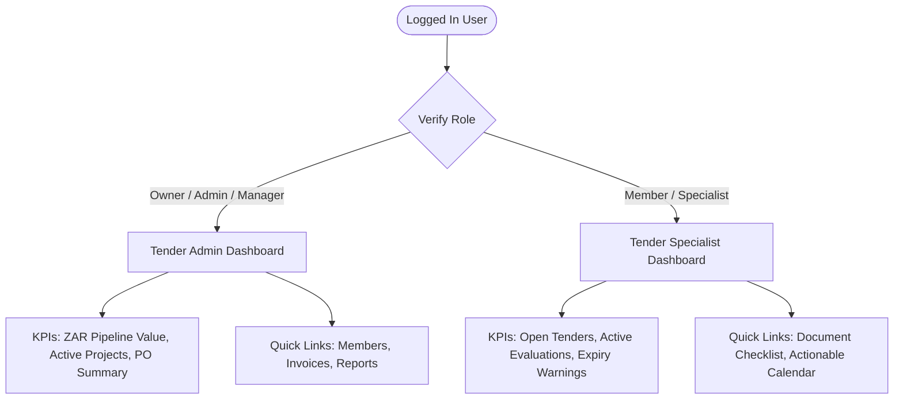

# Product Requirements Document (PRD): Dashboard Module

## 1. Document Control & Metadata
* **Status**: Draft (For Review)
* **Author**: Antigravity AI
* **Version**: 1.0.0
* **Date**: June 6, 2026
* **Target Audience**: Development, QA, Product Management

---

## 2. Product Overview & Goals

The PMG Tracker 360 platform serves diverse users within South African procurement entities. The primary dashboard currently presents a single, generic view mixing executive business health metrics with tactical, day-to-day bidding deadlines. This results in information overload for operational staff and lack of focus for executive administrators.

### Core Goals:
1. **Implement Role-Based Switcher**: Detect the logged-in user's role within the organization (`Owner`/`Admin`/`Manager` vs. `Specialist`/`Member`) and serve a customized dashboard layout.
2. **Focus Tender Admin View**: Present high-level financial metrics, win rates, conversion rates, and purchase order tracking.
3. **Focus Tender Specialist View**: Present actionable bidding pipelines, upcoming closing dates, validity warnings, and compliance document checklists.
4. **Localization**: Display all currency aggregates in South African Rands (ZAR, `R`) and dates in local timezone formats.

---

## 3. Personas & User Journeys

### 3.1. Persona 1: Tender Admin (Executive / Manager)
* **Needs**: High-level financial reporting, win/loss conversion ratios, overall pipeline value, resource allocation details, and billing access.
* **Friction in Current App**: Overwhelmed by granular activity feeds and checklists; missing executive indicators like funnel conversion charts.

### 3.2. Persona 2: Tender Specialist (Bid Compiler / Operations)
* **Needs**: Close tracking of open opportunities, submission deadlines, bid compliance statuses, and validity extension checklists.
* **Friction in Current App**: Exposed to sensitive financial totals (pipeline value) and project logs which are outside their operational scope; lacks immediate indicators for missing compliance documents.

---

## 4. Functional Requirements

### 4.1. Role-Based Rendering Engine
* **REQ-001**: The dashboard root page ([page.tsx](file:///D:/websites/pmg-tracker-360/apps/tracker/src/app/(dashboard)/dashboard/page.tsx)) must fetch the user's active membership role.
* **REQ-002**: Render `<TenderAdminDashboard />` if the role is `owner`, `admin`, or `manager`.
* **REQ-003**: Render `<TenderSpecialistDashboard />` if the role is `member` or other specialist positions.

### 4.2. Tender Admin View Component
* **REQ-004**: Display **Primary Admin KPIs**:
  * *Total Pipeline Value*: Combined ZAR value of all `open` and `evaluation` tenders.
  * *Win Rate*: Ratio of `appointed/awarded` tenders to total finalized (`appointed/awarded` + `rejected/lost`) tenders.
  * *Active Projects*: Count of ongoing delivery contracts.
  * *Purchase Orders*: Combined value and count of active POs.
* **REQ-005**: Display **Financial Conversion Funnel**:
  * Visual chart showing conversion values from `Open ➔ Evaluation ➔ Appointed/Awarded`.
* **REQ-006**: Display **Quick Navigation Hub**:
  * Clickable navigation cards linking to:
    * `/reports` (Analytics)
    * `/settings/members` (Team Role Management)
    * `/billing` (Invoices & Subscriptions)

### 4.3. Tender Specialist View Component
* **REQ-007**: Display **Primary Specialist KPIs**:
  * *Open Tenders*: Number of active opportunities awaiting submission.
  * *Tenders Under Evaluation*: Submissions currently being assessed by clients.
  * *Validity Warnings*: Tenders whose evaluation periods are expiring within 14 days and need extension letters.
* **REQ-008**: Display **Submission Calendar Widget**:
  * Monthly/weekly calendar showing closing dates of open opportunities.
* **REQ-009**: Display **Compliance Checklist Widget**:
  * Checklist indicating missing mandatory South African compliance documents for active bids:
    * Central Supplier Database (CSD) Registration Report
    * B-BBEE Certificate / Sworn Affidavit
    * SARS Tax Clearance Status Pin
    * MBD Forms (Municipal Bidding Documents - e.g., MBD 4, 6.1, 8, 9)

---

## 5. UI/UX & Aesthetic Requirements (Frontend Design Skill Guidelines)

* **Typography**: Pair a high-character geometric display font (e.g., `Outfit` or `Space Grotesk` for headers) with a highly legible sans-serif font (e.g., `Inter` or `Plus Jakarta Sans` for body text) configured inside Next.js layout.
* **Colors & Themes**: Apply a sleek dark-mode compatible layout using CSS variables. Implement modern container styling such as translucent card backgrounds with a subtle blur (`backdrop-blur-md bg-card/70 border-border/40`).
* **Micro-interactions**: Use staggered CSS transition delays (`transition-all duration-300 ease-out`) for loading metric cards so they slide and fade in sequentially on load.
* **No Placeholders**: Ensure mock graphics or charts use actual lightweight SVGs or Recharts components with mock data instead of image placeholders.

---

## 6. Accessibility & SEO Requirements

* **A-001**: Render a `<SkipNavigation target="#main-content" />` at the root of the layout.
* **A-002**: Wrap the main dashboard content in a `<main id="main-content" tabIndex={-1}>` element for correct skip-link focus redirection.
* **A-003**: Ensure all charts and color-coded status badges have screen-reader descriptions (e.g., `aria-label="Funnel chart showing R12.5M in Open Tenders"`).
* **SEO-001**: Ensure the dashboard page has meta titles and descriptions indicating the user's workspace (e.g., `<title>Dashboard | PMG Tracker 360</title>`).
