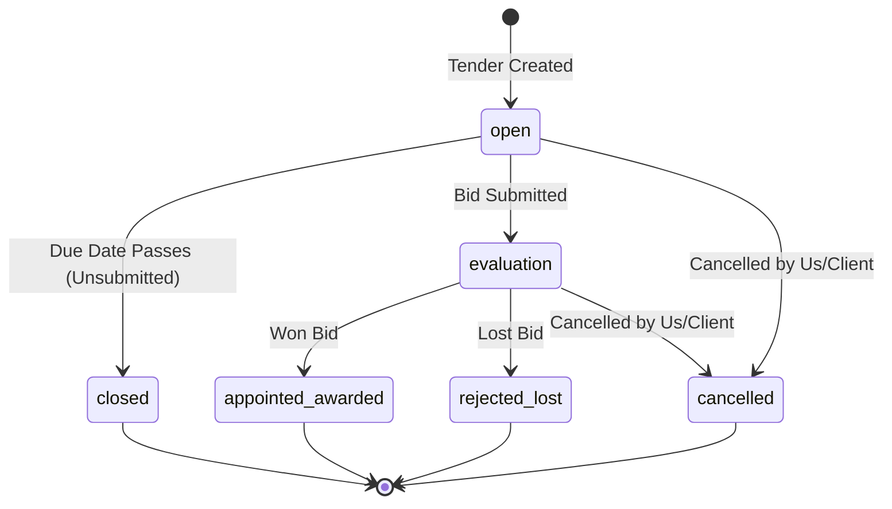
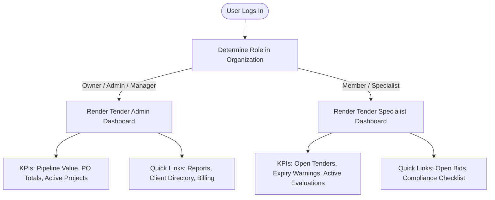

# UI/UX Audit & Improvements: Dashboard Module

This document presents a comprehensive UI/UX audit of the primary dashboard, contrasting the needs of the **Tender Admin** against the **Tender Specialist**, and outlines concrete layout and feature improvements aligned with our revised tender lifecycle status design.

---

## 1. Current State Assessment

The main dashboard ([page.tsx](file:///D:/websites/pmg-tracker-360/apps/tracker/src/app/(dashboard)/dashboard/page.tsx)) displays a mixture of high-level business health stats, timeline metrics, recent activities, and calendar deadlines. 

### What is Displayed:
1. **Primary KPIs**:
   * **Total Pipeline Value**: Consolidated currency value of all tenders.
   * **Win Rate**: Overall percentage of tenders won.
   * **Active Projects**: Numeric count of Appointed / Awarded tenders converted to projects.
   * **Upcoming Deadlines**: Countdown of tenders closing in the next 30 days.
2. **Secondary Metrics**:
   * **Total Tenders**: General count with status distribution.
   * **Client Engagement**: Ratio of clients with complete contact information.
   * **Purchase Orders**: Total count of active POs and their combined ZAR value.
   * **Overdue Items**: Tenders past their closing date that were not submitted (should transition to `closed`).
3. **Widgets & Actions**:
   * Quick action buttons at the top: `Create Tender`, `Create PO`, `Create Project`, `Create Client` (guarded by role permissions).
   * **Status Distribution**: Breakdown of active status percentages.
   * **Recent Activity**: Scans tender creation and status updates.
   * **Upcoming Deadlines**: Displays a checklist of upcoming closing dates.

---

## 2. Audience Gap Analysis

The current single-view dashboard blends high-level management stats with day-to-day submission deadlines, leading to information overload and a lack of focus for specific user personas.

| Feature / Metric | Relevance to Tender Admin | Relevance to Tender Specialist | Audit Finding & Recommendation |
| :--- | :--- | :--- | :--- |
| **Total Pipeline Value** | 🔴 High (Business Health) | ⚪ Low (No impact on bid prep) | Irrelevant to Specialists. Hide or move to a separate Admin panel. |
| **Active Projects** | 🔴 High (Execution Tracking) | ⚪ Low (Specialist stops at Award) | Specialists do not manage post-award delivery. Remove from their view. |
| **Purchase Orders & ZAR Value** | 🔴 High (Financial matching) | ⚪ Low (Specialist doesn't issue POs) | Highly operational financial info. Should be Admin-only. |
| **Client Engagement %** | 🟡 Medium (Directory Health) | ⚪ Low (Specialist references contacts) | A maintenance metric of little value to bid writers. |
| **Upcoming Deadlines** | 🟡 Medium (Resource Allocation) | 🔴 High (Crucial time constraint) | Keep for both, but focus on assignment/tasks for Specialists. |
| **Overdue Items** | 🔴 High (Compliance Audit) | 🔴 High (Missed submissions) | Critical for both. Highlights potential operational failures. |

---

## 3. Revised Tender Status Lifecycle

Our system uses the following six distinct statuses to track bids, replacing the legacy draft concepts with a more operationally accurate workflow:

1. **open**: All tenders where we can still submit (closing date has not passed yet).
2. **closed**: All tenders where the closing date has passed and the bid was not submitted. *Status must auto-set to closed when the closing date passes.*
3. **evaluation**: All tenders that have been submitted and are currently under evaluation.
4. **appointed/awarded**: Bids won and successfully awarded.
5. **rejected/lost**: Bids lost or rejected.
6. **cancelled**: Tenders cancelled by either the organization or the client.

---

## 4. Proposed Improvements

To maximize usability, we propose implementing **Role-Based Dashboard Layouts** that automatically adapt to the user's role in the organization.

### 4.1. Tender Admin Dashboard Enhancements
1. **Financial Funnel Chart**: Replace the monthly trends placeholder with a conversion funnel chart displaying ZAR value transitions from `Open ➔ Evaluation ➔ Appointed/Awarded`.
2. **Quick Navigation Hub**: Add dedicated navigation links to key operational areas:
   * 🔗 `Go to Reports & Analytics`
   * 🔗 `Manage Organization Members & Roles`
   * 🔗 `View Financial Invoices & Billing`
3. **Actionable Alerts**: Highlight overdue PO deliveries or unlinked purchase orders.

### 4.2. Tender Specialist Dashboard Layout
1. **Operational Metrics Bar**:
   * **Open Tenders**: Number of active opportunities currently in `open` status (closing date in the future).
   * **Tenders Under Evaluation**: Count of submitted bids with `evaluation` status awaiting response.
   * **Validity Expiry Warnings**: Bids whose validity deadline is approaching and need extension checks.
   * **My Tasks / Pending Docs**: Checklist of compliance documents needing upload.
2. **Submission Calendar Widget**: Replace the generic activity feed with an interactive calendar highlighting immediate closing dates.
3. **Compliance Health Checklist**: A visual list showing which active tenders are missing mandatory South African compliance docs (e.g., CSD report, BBBEE certificate, Tax pin).
