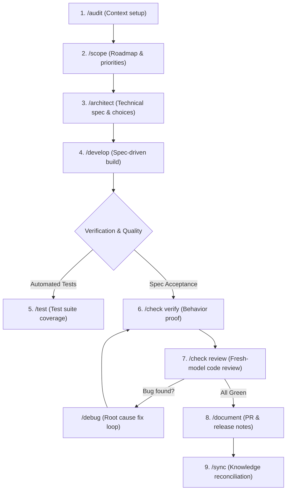

# PMG Tracker 360 - Agent Skills Workflow Guide

This guide documents how to use the 9 agent skills installed from `JavaScript-Mastery-Pro/skills` in the **PMG Tracker 360** codebase.

---

## 1. Skill Suite Overview

The 9 skills form an end-to-end, spec-driven engineering lifecycle:

| Skill | Trigger / Command | Primary Responsibility | Owned Artifacts |
| :--- | :--- | :--- | :--- |
| **`audit`** | `/audit [target]` | Bootstraps or refreshes AI project context, tech stack rules, and conventions. | `AGENTS.md`, `CLAUDE.md` |
| **`scope`** | `/scope [feature/plan]` | High-level roadmap planning, feature ordering, and progress tracking. | `docs/scope/scope.md` |
| **`architect`** | `/architect [topic]` | Technical design, trade-off analysis, and build specification authoring. | `docs/specs/NNNN-*.md` |
| **`develop`** | `/develop [feature]` | Implements features according to an approved spec and updates milestone checkboxes. | Source code files |
| **`test`** | `/test [target]` | Generates or updates test suites (unit, integration, edge cases). | Test files (`*.test.ts`, etc.) |
| **`check`** | `/check [verify\|review]` | **Verify:** Proves implementation matches acceptance criteria.<br>**Review:** Senior code review across standards. | `docs/reviews/` |
| **`debug`** | `/debug [issue]` | Hypothesis-driven root-cause debugging loop (reproduce &rarr; localize &rarr; fix &rarr; verify). | Minimal bugfix diffs |
| **`document`** | `/document [pr\|changelog]` | Crafts human-facing prose: PR descriptions, changelogs, release notes, postmortems. | Docs, PR summaries |
| **`sync`** | `/sync` | Reconciles repo knowledge, updates `AGENTS.md`, and flags stale specs around merge. | `AGENTS.md`, specs status |

---

## 2. End-to-End Development Lifecycle



---

## 3. How to Use Each Skill (With Codebase Examples)

### 3.1. `/audit` — Project Context & Conventions
Run `/audit` when starting in a new workspace or when project conventions need refreshing.

- **Full repo bootstrap:**
  ```bash
  /audit
  ```
- **Area-specific audit (e.g. DB package or Admin app):**
  ```bash
  /audit packages/db
  /audit apps/tracker
  ```
- **What it does:** Scans dependencies, framework configs (`turbo.json`, `package.json`, `drizzle.config.ts`), and generates lightweight, tool-agnostic `AGENTS.md` context files.

---

### 3.2. `/scope` — Roadmap & Feature Tracking
Tracks high-level features in `docs/scope/scope.md` with lifecycle statuses: `planned` &rarr; `in-progress` &rarr; `done`.

- **Plan a milestone or new epic:**
  ```bash
  /scope plan "Tender Register PDF export and audit trail"
  ```
- **Add a single feature to the existing scope:**
  ```bash
  /scope add "Bulk document download as ZIP for tender returnables"
  ```
- **Reconcile progress (bare `/scope`):**
  ```bash
  /scope
  ```
  Shows where things stand (git branch state, feature completion status, and next queued work).

---

### 3.3. `/architect` — Technical Specs & Architectural Decisions
Run `/architect` whenever a load-bearing technical decision is unmade (schema design, storage provider, auth permissioning, or component architecture).

- **Design a new feature:**
  ```bash
  /architect "S3/R2 presigned upload pipeline for large tender returnables"
  ```
- **Cross-cutting architectural standard:**
  ```bash
  /architect "Server Action error handling and Drizzle transaction boundary standards"
  ```
- **Artifact produced:** `docs/specs/NNNN-<topic>.md` containing requirements, options considered, decisions, build plan, and acceptance criteria.

---

### 3.4. `/develop` — Spec-Driven Implementation
Builds features directly against the approved spec from `/architect`.

- **Execute a scoped feature:**
  ```bash
  /develop "Tender Register PDF export"
  ```
- **What it does:**
  1. Reads `AGENTS.md` and the linked spec in `docs/specs/`.
  2. Updates the feature status in `docs/scope/scope.md` to `in-progress`.
  3. Writes production-grade code, checking off milestones as it proceeds.
  4. Advances status toward `done`.

---

### 3.5. `/test` — Automated Testing
Writes comprehensive test suites for recent changes.

- **Write tests for uncommitted or recent changes:**
  ```bash
  /test
  ```
- **Target a specific package or module:**
  ```bash
  /test apps/tracker/src/actions/tenders.ts
  ```
- **What it covers:** Happy path, boundary/edge conditions, error and authorization failure states, and regression assertions.

---

### 3.6. `/check` — Acceptance Verification & Senior Review
Validates changes before proposing or merging PRs.

- **Verify acceptance criteria against the spec:**
  ```bash
  /check verify "Tender Register PDF export"
  ```
  Drives the application or actions to ensure every criterion in the spec is satisfied.

- **Independent senior code review:**
  ```bash
  /check review
  ```
  Reviews the diff against project standards (security, TypeScript strictness, database efficiency) without modifying code. Output saved to `docs/reviews/`.

---

### 3.7. `/debug` — Hypothesis-Driven Root-Cause Debugging
Use when encountering failing tests, unexpected runtime behavior, or broken database queries.

- **Diagnose and fix an issue:**
  ```bash
  /debug "Presigned S3 URL upload fails with 403 SignatureDoesNotMatch on Safari"
  ```
- **Discipline:** Reproduce &rarr; Localize &rarr; Hypothesize &rarr; Test &rarr; Minimal Fix &rarr; Verify. Avoids speculative wide refactoring.

---

### 3.8. `/document` — Human-Facing Documentation & PRs
Generates clean documentation from actual diffs and commits.

- **Draft a Pull Request description:**
  ```bash
  /document pr
  ```
- **Generate changelog or release note entry:**
  ```bash
  /document changelog
  /document release-note
  ```
- **Draft postmortem after an incident:**
  ```bash
  /document postmortem
  ```

---

### 3.9. `/sync` — Knowledge Reconciliation
Run right before or after merge to keep repo knowledge fresh.

- **Execute sync:**
  ```bash
  /sync
  ```
- **What it does:**
  - Updates `AGENTS.md` with newly added routes, packages, or models.
  - Reconciles `docs/scope/scope.md` against merged commits.
  - Marks completed specs as `Accepted` or flags specs rendered stale by diffs.

---

## 4. Alignment with PMG Tracker 360 Repository Rules

As outlined in [docs/development/ai-contribution-workflow.md](file:///d:/websites/pmg-tracker-360/docs/development/ai-contribution-workflow.md):

1. **Branch Protection:**
   - Never commit directly to `master` (production) or `dev` (integration).
   - Always create a dedicated branch from `dev` before developing:
     ```bash
     git checkout dev
     git pull origin dev
     git checkout -b feat/<descriptive-feature-name>
     ```
2. **Quality Gates:**
   - Before requesting review or merging, run `/check verify` and `/test`.
   - Ensure Drizzle schemas, migrations, and TypeScript checks pass.
3. **PR Creation:**
   - Use `/document pr` to format the pull request description with changed files, test results, and follow-ups.
