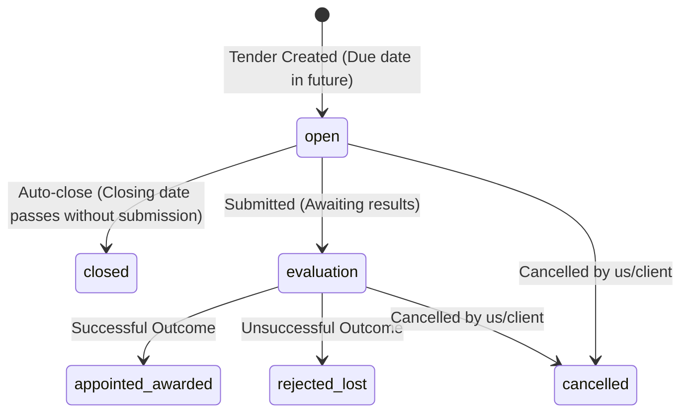

# Product Requirements Document (PRD): Tenders Module

## 1. Document Control & Metadata
* **Status**: Draft (For Review)
* **Author**: Antigravity AI
* **Version**: 1.0.0
* **Date**: June 6, 2026
* **Target Audience**: Development, QA, Product Management

---

## 2. Product Overview & Goals

The Tenders module is a core part of the PMG Tracker 360 customer journey. Bidding teams track government and private sector opportunities. However, the current module suffers from a hard-blocked validity extension form, commented-out table data, legacy "draft" filters, and timezone date shifts.

### Core Goals:
1. **Enforce 6-Status Lifecycle**: Align validation schemas, client displays, and server filters around the six official statuses: `open`, `closed`, `evaluation`, `appointed/awarded`, `rejected/lost`, `cancelled`.
2. **Implement Auto-Close for Expired Bids**: Automatically set an `open` tender to `closed` when its closing date passes if it was not submitted.
3. **Fix the Extension Form Block**: Resolve the missing file input bug in `extension-form.tsx` that currently makes it impossible to submit bid extensions.
4. **Restore commented-out value columns**: Re-enable and ZAR-localize the value columns in overview tables.
5. **Timezone Date Safety**: Prevent the picker from saving shifted dates.

---

## 3. Revised Tender Statuses & Rules

1. **open**: Closing date is in the future; bid can be compiled and submitted.
2. **closed**: Closing date is in the past; bid was never marked as submitted. *Must auto-transition from open to closed once closing date passes.*
3. **evaluation**: Bid submitted to the client; currently awaiting decision.
4. **appointed/awarded**: Bid won and converted to a project.
5. **rejected/lost**: Bid unsuccessful.
6. **cancelled**: Cancelled by client or internally.

---

## 4. Functional Requirements

### 4.1. Lifecycle & Schema Alignment
* **REQ-001**: Update the Drizzle/Zod schema validation in [validations/tender.ts](file:///D:/websites/pmg-tracker-360/apps/tracker/src/lib/validations/tender.ts) to restrict status enums to: `open`, `closed`, `evaluation`, `appointed/awarded`, `rejected/lost`, `cancelled`.
* **REQ-002**: Refactor status badge formatting to support the updated list (including colors and localized labels).

### 4.2. Auto-Setting Expiry Task
* **REQ-003**: Create a server-side action or task that queries all tenders with `status = 'open'` where the `submissionDate` is past the current system timestamp, and auto-updates their status to `closed`.

### 4.3. Fix Tender Extension Form Block
* **REQ-004**: Add a fully functional file input field inside `<ExtensionForm />` ([extension-form.tsx](file:///D:/websites/pmg-tracker-360/apps/tracker/src/components/tenders/extension-form.tsx)) to let users upload the official extension letter document.
* **REQ-005**: Alternatively, make the extension letter file validation optional if the upload API is undergoing separate integration.

### 4.4. Restore and Localize Value Column
* **REQ-006**: Un-comment the commented-out value columns in [tenders-table.tsx](file:///D:/websites/pmg-tracker-360/apps/tracker/src/components/tenders/tenders-table.tsx).
* **REQ-007**: Apply South African Rand (ZAR, `R`) currency formatting on the numbers.
* **REQ-008**: Replace the USD `$` prefix in the header widgets on the overview page with the `R` Rand prefix.

### 4.5. Timezone-Safe Date Inputs
* **REQ-009**: Implement a localized date parsing utility for calendar fields, converting calendar inputs to UTC midnight relative to the South African Standard Time (SAST, UTC+2) offset to prevent dates from retroactively shifting back by one day.

### 4.6. Overview Table Delete Hook
* **REQ-010**: Implement the empty delete handler callback `handleDeleteTender` inside the overview [client-wrapper.tsx](file:///D:/websites/pmg-tracker-360/apps/tracker/src/app/(dashboard)/tenders/overview/client-wrapper.tsx) so clicking the "Delete" option in the dropdown actually calls the database.

---

## 5. UI/UX & Aesthetics (Frontend Design Skill Guidelines)

* **Badge Styling**: Status badges must follow a consistent design system (using semi-transparent backgrounds with thin matching borders):
  * `open`: Emerald green text and border.
  * `closed`: Charcoal grey text and border.
  * `evaluation`: Cobalt blue text and border.
  * `appointed/awarded`: Amber/Gold text and border.
  * `rejected/lost`: Crimson red text and border.
  * `cancelled`: Zinc/Slate grey text and border.
* **Alert States**: Days left columns should highlight red if a bid closing date is overdue, orange if due within 3 days, and default text otherwise.
