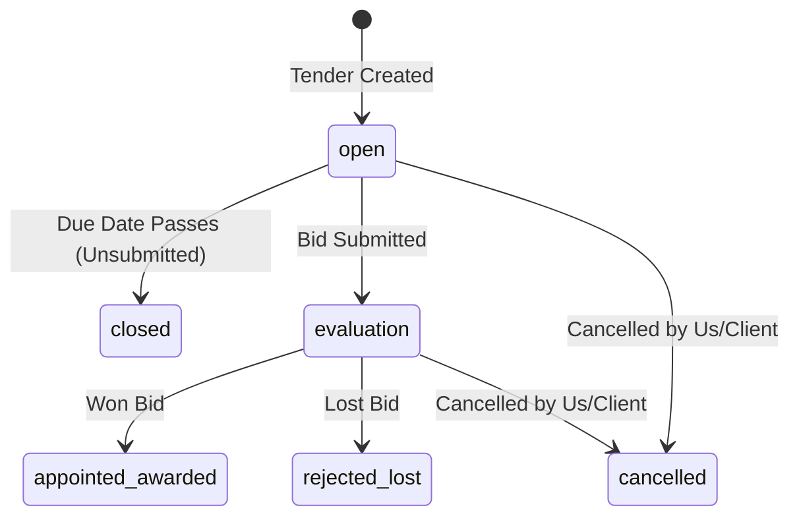
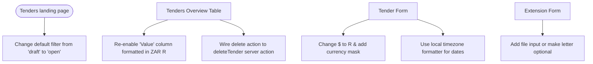

# UI/UX Audit & Improvements: Tenders Module

This document presents a comprehensive UI/UX and functional audit of the Tenders module, contrasting the needs of the **Tender Admin** against the **Tender Specialist**, identifying critical blockers and interface inconsistencies, and outlining concrete layouts and features to improve the user experience.

---

## 1. Current State Assessment

The Tenders module consists of multiple subpages and components that handle the creation, overview, listing, tracking, and detail management of tenders.

### 1.1. Module Structure & Pages

1. **Active Tenders List** ([tenders/page.tsx](file:///D:/websites/pmg-tracker-360/apps/tracker/src/app/(dashboard)/tenders/page.tsx))
   * *Purpose*: Main dashboard list for active opportunities.
   * *Features*: Key metrics counters (Total, Appointed/Awarded, Pending, Rejected/Lost, Total Value) and the `<TenderList />` table.
2. **Tender Management Overview** ([tenders/overview/page.tsx](file:///D:/websites/pmg-tracker-360/apps/tracker/src/app/(dashboard)/tenders/overview/page.tsx))
   * *Purpose*: Executive-level dashboard summarizing pipeline health.
   * *Features*: Extended stats (Win Rate, Active counts, Overdue items), upcoming deadlines widget, recent activity feed, and the `<TendersTable />` wrapper.
3. **Submitted Tenders List** ([tenders/submitted/page.tsx](file:///D:/websites/pmg-tracker-360/apps/tracker/src/app/(dashboard)/tenders/submitted/page.tsx))
   * *Purpose*: Filters for evaluation state and tracks live evaluations and appointed/awarded outcomes.
4. **Tender Detail Workspace** ([tenders/[id]/page.tsx](file:///D:/websites/pmg-tracker-360/apps/tracker/src/app/(dashboard)/tenders/[id]/page.tsx))
   * *Purpose*: Full view of a tender's core information, clients, document logs, and validity extension history.
5. **Tender Forms (Create / Edit)** ([tender-form.tsx](file:///D:/websites/pmg-tracker-360/apps/tracker/src/components/tenders/tender-form.tsx))
   * *Purpose*: Data input for new or updated opportunities, client linking, and initial validity options.

---

## 2. Updated Tender Status Lifecycle

Our system uses the following six distinct statuses to track bids, replacing legacy draft concepts with a more operationally accurate workflow:

1. **open**: All tenders where we can still submit (closing date has not passed yet).
2. **closed**: All tenders where the closing date has passed and the bid was not submitted. *Status must auto-set to closed when the closing date passes.*
3. **evaluation**: All tenders that have been submitted and are currently under evaluation.
4. **appointed/awarded**: Bids won and successfully awarded.
5. **rejected/lost**: Bids lost or rejected.
6. **cancelled**: Tenders cancelled by either the organization or the client.



---

## 3. Audience Gap Analysis

The Tenders module serves two primary user roles with distinct business and operational objectives:

| Feature / Page Element | Relevance to Tender Admin | Relevance to Tender Specialist | Audit Finding & Recommendation |
| :--- | :--- | :--- | :--- |
| **Total Pipeline Value & Win Rate** | 🔴 **High** (Business health & forecasting) | ⚪ **Low** (No impact on writing bids) | Crucial for Admins to evaluate company performance. Display prominently in Admin views. |
| **Default View Configuration** | ⚪ **Low** (Needs to see final pipeline value) | 🔴 **High** (Actively working on active bids) | The main page defaults to loading *Drafts only* (a legacy status). Update default load filter to *Open* or *All Active*. |
| **Validity Date Expiry Warnings** | 🔴 **High** (Risk mitigation against bid rejection) | 🔴 **High** (Must request extension letters from clients) | Critical for both. Approaching expiry dates need visual alerts (amber/red badges) in tables. |
| **Document Management** | 🟡 **Medium** (Auditing and final compliance archive) | 🔴 **High** (Daily uploads: specifications, CSD tax pins, BBBEE docs) | Placeholder in details view is a severe blocker for Specialists. Must activate document uploads. |
| **Tender Value Columns** | 🔴 **High** (Needs quick pipeline valuation) | 🟡 **Medium** (Operational context) | The "Value" column is commented out in the overview table, preventing Admins from comparing values at a glance. |
| **Delete Tender Actions** | 🔴 **High** (Restricted cleanup operation) | ⚪ **Low** (Should not have delete rights) | Overview table's Delete item does nothing (empty TODO callback). Implement role restriction and fix action. |

---

## 4. Specific Findings & UX Issues

A code-level review revealed the following issues, categorized by severity:

### 4.1. Critical Issues 🔴

#### 1. Tender Extension Form is Hard-Blocked
* **Files**: [extension-form.tsx:L70-81](file:///D:/websites/pmg-tracker-360/apps/tracker/src/components/tenders/extension-form.tsx#L70-L81) and [extension-form.tsx:L230-240](file:///D:/websites/pmg-tracker-360/apps/tracker/src/components/tenders/extension-form.tsx#L230-L240)
* **Finding**: The form submission logic strictly enforces that a file (the extension letter) must be uploaded:
  ```typescript
  if (!file) {
    toast.error('File Required', { description: 'Please upload the extension letter.' });
    return;
  }
  ```
  However, the UI JSX does not contain a file input element, rendering a static placeholder message instead: `"File upload is currently unavailable - Coming soon in a future update"`.
* **Impact**: The user is completely blocked from ever submitting a tender extension. Since extensions are the only way to update the validity dates, this blocks core functionality.

---

### 4.2. High Issues 🟠

#### 1. Default Active List View Loads Legacy Drafts
* **Files**: [page.tsx:L39](file:///D:/websites/pmg-tracker-360/apps/tracker/src/app/(dashboard)/tenders/page.tsx#L39) and [page.tsx:L152](file:///D:/websites/pmg-tracker-360/apps/tracker/src/app/(dashboard)/tenders/page.tsx#L152)
* **Finding**: The main Tenders landing page defaults to loading `draft` tenders on initial load. Since the lifecycle has shifted to start at `open`, this causes a blank table and a "No tenders found" message on first load.
* **Impact**: Broken first-load experience. The page should default-load `open` tenders.

#### 2. USD Currency Formatting in South African Context
* **Files**: [page.tsx:L163](file:///D:/websites/pmg-tracker-360/apps/tracker/src/app/(dashboard)/tenders/overview/page.tsx#L163) and [tender-form.tsx:L509](file:///D:/websites/pmg-tracker-360/apps/tracker/src/components/tenders/tender-form.tsx#L509)
* **Finding**: The overview page displays total pipeline value with a `$` prefix (`${stats.totalValue.toLocaleString()}`) instead of South African Rands (`R`). The form also renders a `<DollarSign />` icon for the tender value field.
* **Impact**: Disconnects the application from the South African local public/private sector procurement target market.

#### 3. Missing Auto-Transition for Closed Tenders
* **Files**: [tenders.ts (Server Actions)](file:///D:/websites/pmg-tracker-360/apps/tracker/src/server/tenders.ts)
* **Finding**: There is no server-side task or middleware that checks if the submission date of an `open` tender has passed and automatically transitions its status to `closed`.
* **Impact**: Operational database drift. Bids whose deadlines have passed remain marked as `open`, leading to incorrect dashboard counters.

---

### 4.3. Medium Issues 🟡

#### 1. Commented-Out Tender Value Column
* **Files**: [tenders-table.tsx:L143-145](file:///D:/websites/pmg-tracker-360/apps/tracker/src/components/tenders/tenders-table.tsx#L143-L145) and [tenders-table.tsx:L182-184](file:///D:/websites/pmg-tracker-360/apps/tracker/src/components/tenders/tenders-table.tsx#L182-L184)
* **Finding**: The "Value" column header and body cells are commented out in the `<TendersTable />` component.
* **Impact**: Users cannot scan or compare bid valuations across the overview table. They must open each individual tender to find out its value.

#### 2. Silent Delete Button Failure
* **File**: [client-wrapper.tsx:L129-131](file:///D:/websites/pmg-tracker-360/apps/tracker/src/app/(dashboard)/tenders/overview/client-wrapper.tsx#L129-L131)
* **Finding**: The `handleDeleteTender` callback is an empty TODO callback:
  ```typescript
  const handleDeleteTender = useCallback((tenderId: string) => {
    // TODO: Implement delete functionality
  }, []);
  ```
* **Impact**: Clicking the "Delete" menu item in the table dropdown does nothing, failing silently without notifying the user or deleting the record.

#### 3. Date Timezone Shift on picker
* **Files**: [tender-form.tsx:L391-397](file:///D:/websites/pmg-tracker-360/apps/tracker/src/components/tenders/tender-form.tsx#L391-L397) and [tender-form.tsx:L478-484](file:///D:/websites/pmg-tracker-360/apps/tracker/src/components/tenders/tender-form.tsx#L478-L484)
* **Finding**: Dates are converted for formatting via `.toISOString().split('T')[0]`.
* **Impact**: Since South Africa operates on SAST (GMT+2), a Date representing local midnight (00:00:00) gets converted to the previous day at 22:00:00 UTC, causing the calendar picker to retroactively shift the date back by one day on form reload.

---

### 4.4. Low Issues 🟢

#### 1. Incomplete Document Management
* **Files**: [tender-details.tsx:L609-620](file:///D:/websites/pmg-tracker-360/apps/tracker/src/components/tenders/tender-details.tsx#L609-L620) and [tender-form.tsx:L574-581](file:///D:/websites/pmg-tracker-360/apps/tracker/src/components/tenders/tender-form.tsx#L574-L581)
* **Finding**: Document management on both the creation form and detail tabs is handled via static placeholder cards indicating "Document upload/management is currently unavailable."
* **Impact**: Prevents Specialists from attaching tender guidelines, terms of reference, or submitted bids directly to the tender records.

---

## 5. Proposed Improvements

To maximize usability and fix functional gaps, we propose the following improvements:



### 5.1. Step-by-Step Solutions

1. **Fix the Extension Form Blocker**:
   * Add a file input element in [extension-form.tsx](file:///D:/websites/pmg-tracker-360/apps/tracker/src/components/tenders/extension-form.tsx) or update the validator to make the file optional until the upload server action is fully integrated.
2. **Restore commented-out value column**:
   * Un-comment the value column headers and cells in [tenders-table.tsx](file:///D:/websites/pmg-tracker-360/apps/tracker/src/components/tenders/tenders-table.tsx). Ensure values are formatted in ZAR using the `formatCurrency` utility.
3. **Change Default status filter on Tenders page**:
   * Modify the initial landing page filter from `'draft'` to `'open'`. Let the user toggle filters if they want to view other statuses.
4. **ZAR Currency and Icon Localization**:
   * Replace the `<DollarSign />` icon with an `R` prefix label in [tender-form.tsx](file:///D:/websites/pmg-tracker-360/apps/tracker/src/components/tenders/tender-form.tsx).
   * Replace the `$` symbol with `R` in the stats headers.
5. **Implement overview delete action**:
   * Wire the `handleDeleteTender` callback in [client-wrapper.tsx](file:///D:/websites/pmg-tracker-360/apps/tracker/src/app/(dashboard)/tenders/overview/client-wrapper.tsx) to call the `deleteTender` server action and refresh the list.
6. **Implement Auto-Setting to Closed**:
   * Create an automated query script or background action that runs checks on tenders with status `open` whose `submissionDate` is prior to the current date, and transitions them to `closed`.

---

## 6. UI/UX Actionable Checklist for Developers

- [ ] **Fix Extension Form Block**: Update [extension-form.tsx](file:///D:/websites/pmg-tracker-360/apps/tracker/src/components/tenders/extension-form.tsx) to make file upload optional or render a valid file input element.
- [ ] **Un-comment Value Column**: Restore value column rendering in [tenders-table.tsx](file:///D:/websites/pmg-tracker-360/apps/tracker/src/components/tenders/tenders-table.tsx).
- [ ] **Default to Open Tenders**: Update [tenders/page.tsx](file:///D:/websites/pmg-tracker-360/apps/tracker/src/app/(dashboard)/tenders/page.tsx) to default-load `open` status, not legacy `draft`.
- [ ] **ZAR Currency Format**: Localize currency indicators to ZAR (`R` or `ZAR`) on the overview page and form layout.
- [ ] **Overview Table Delete Hook**: Implement the `handleDeleteTender` callback inside the overview client wrapper.
- [ ] **Local Calendar Timezone Fix**: Adjust date formatting to use timezone-safe methods, preventing date offsets on page load.
- [ ] **Auto-Close Rule**: Set up server-side checking to auto-transition expired `open` tenders to `closed`.
